## 6.7
### 9
进行以下操作后可以得到 $K_{3,3}$：
1. 删去顶点 g 及其邻边
2. 删去边 $\{a,e\}$
3. 删去 $c$ 及其邻边（$\{c,d\},\{c,f\}$）并添加边 $\{d,f\}$
3. 删去 $h$ 及其邻边（$\{h,i\},\{h,e\}$）并添加边 $\{e,i\}$
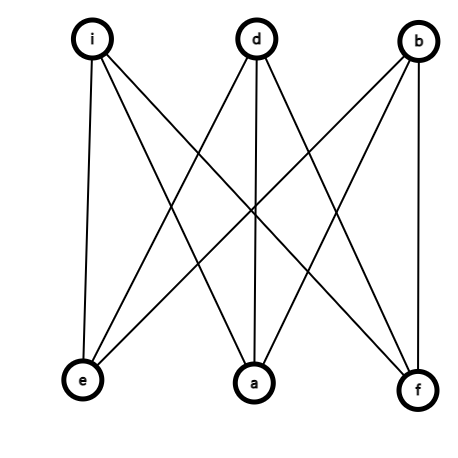

### 17
因为没有长度为 4 或更短的回路，因此所有面的度至少为 5，则有
$$\sum \deg R=2e\ge 5r=5(e-v+2)$$
因此有 $\frac{3}{5}e\le v+2$ 即 $e\le \frac{5}{3}v-\frac{10}{3}$

### 19
a), c)

- a) 删去得到 $K_4$ 是平面图
- b) 删去得到 $K_5$ 不是平面图
- c) 删去得到 $K_{2,3}$ 是平面图
- d) 删去可能得到 $K_{3,3}$ 不是平面图

### 25
不是平面图。删去点 $b$ 及其邻边，以及 $\{a,e\},\{e,d\}$ 和 $\{f,g\},\{g,c\}$ 可以得到 $K_{3,3}$
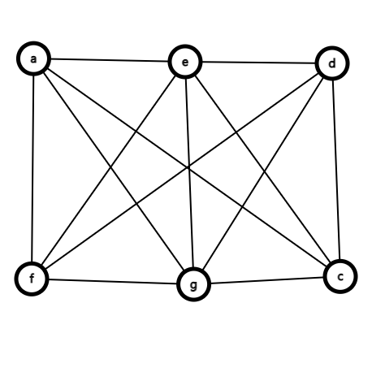

### 29
在 x 轴放置 $(\pm 1,0),(\pm 2,0),\cdots,(\pm \frac{n}{2},0)$，在 y 轴放置 $(0,\pm 1),(0,\pm 2),\cdots,(0,\pm \frac{m}{2})$  

不妨仅考虑第一象限的情况

不妨设 $x_1<x_2$，两条线 $(x_1,0)-(0,y_1)$ 与 $(x_2,0),(0,y_2)$ 交叉 当且仅当 $y_1>y_2$。

对于每一个 $x_1<x_2$ 都可以找到 $C_{\frac{m}{2}}^2$ 种 $y_1>y_2$ 的情况，且 $x_1<x_2$ 有 $C_{\frac{n}{2}}^2$ 种的情况。共：$C_{\frac{m}{2}}^2C_{\frac{m}{2}}^2=\frac{nm(n-2)(m-2)}{64}$。

拓展到整个坐标系，总共有 $\frac{nm(n-2)(m-2)}{16}$ 种情况。

## 6.8
### 15
$W_n$ 的着色数是 $3+n\bmod 2$（n 奇为 4, n 偶为 3）

### 19
注意到 $C_4,C_5$ 可以同时召开，别的会议都不能同时召开。因此，保证除了 $C_4,C_5$ 之外没有两个会议同时召开即可

### 25
如果超过 $n/2$ 的边着相同的颜色，则这些边无共点，因此这些边连接了超过 $n$ 个顶点，矛盾，因此不超过 $n/2$ 的边着相同的颜色。

### 35
假设存在某个度为 $k-2$ 的节点，删去与之关联的一条边可以得到一个着色数为 $k-1$ 的图；再删去该点及与之关联的边，对剩下的图显然仍可用 $k-1$ 种颜色着色。此时，将该点以及关联的 $k-2$ 条边加回来，这个点最多与 $k-2$ 种颜色相连，必存在一种颜色可以对该点着色。也即，原图可以用 $k-1$ 种颜色着色，矛盾

### 37
- a) 6
- b) 7
- c) 9
- d) 11

## 7.1
### 13
- a) 三种（加号形，四点的链挂一点形，5点链形）
- b) 九种（加号形2种，四点的链挂一点形4种，5点链形3种）

### 25
不存在。从根节点开始，每增加一些叶子，必定是去掉原来的一个叶子并加上 $m-1$ 个叶子。假设进行 $k$ 次这样的操作，则总叶子数是 $1+k(m-1)$，则 $k(m-1)=83$。则有 $m=2$ 或 $m=84$。$m=2$ 时易知树有 7 层，$m=84$ 时易知树有 2 层

### 31
将这 t 棵树的根节点连起来，得到的树有 $n-1$ 条边，连了 $t-1$ 条边，因此原森林有 $n-t$ 条边

### 43

- 先假设有两个重心 $u,v$ 不相邻，考虑它们之间的这条路径，则至少有三个节点（以下的 “它们之间的路径” 都是指 $u,v$ 之间的路径）
- 设 $u$ 的不包含它们之间的这条路径的若干子树中（就是有一个子树是以它们路径上与 u 相邻的那个点为根的，先排除那个子树），最小的子树大小是 $size_u$，则 $v$ 的包含它们路径的那个子树的大小为 $size_u+k,k≥2$。那么这个子树不能是 $u$ 的大小最大的子树，否则 $v$ 的这个包含它们之间的路径的子树，大小比它还大，$v$ 就不是重心了
- 对 $v$ 进行相同的分析，得到同样结论
- 那么 $u,v$ 最大的子树就只能分别是包含它们之间路径的那个子树，假设从它们之间的路径上（不包含它们）的点，延伸出去的点的个数为 $size$（这个 $size$ 已经把路径上的点算上了），则它们这个最大的子树的大小就分别是 $v,u$ 的不包含它们之间路径的子树的大小和，加 $size+1$，又因为它们都是重心，最大子树都最小，则上面所述的这个 “$v,u$ 的不包含它们之间路径的子树的大小和” 应该相等，设其为 $size′$
- 但是发现，若从它们之间的路径上（不包含它们本身）取一点，则这个点沿着它们之间路径的两个子树应该都小于 $size′+size+1$，而其他子树显然都小于 $size′$，那么 $u,v$ 都不是重心，矛盾
- 则重心必须相邻，又因为这是一个树，所以最多只有两个点相邻，最多两个重心

## 7.2
### 13
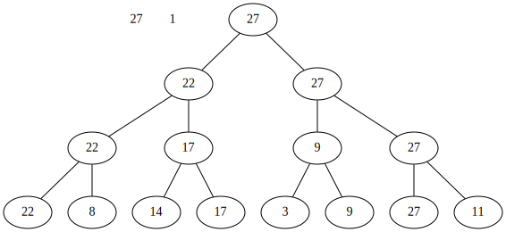
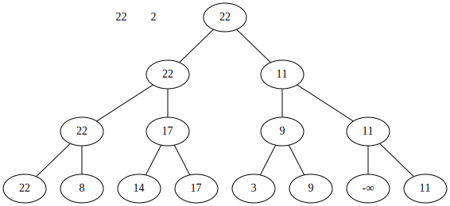
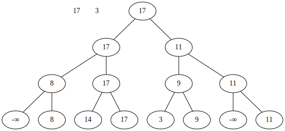
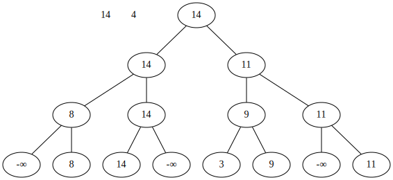
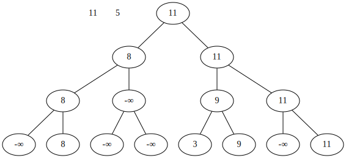
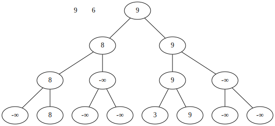
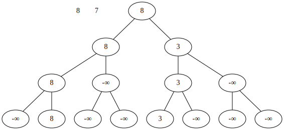
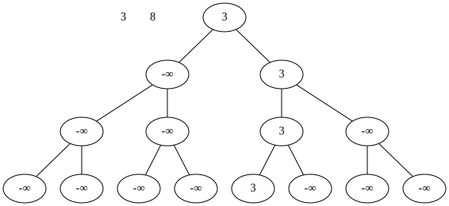

### 35
- a) 1
- b) 3
- c) -2
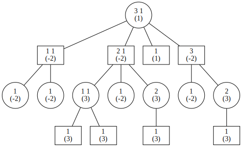
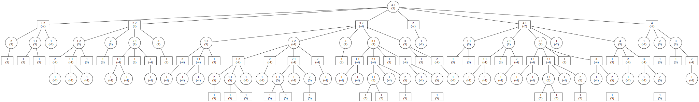
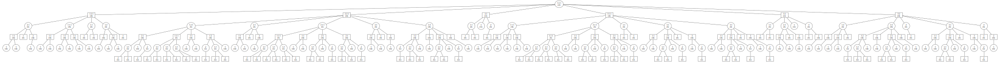

更清晰的版本可见: 
- <https://www.brealid.cn/static/shutu-hw10-dot-a.svg>
- <https://www.brealid.cn/static/shutu-hw10-dot-b.svg>
- <https://www.brealid.cn/static/shutu-hw10-dot-c.svg>