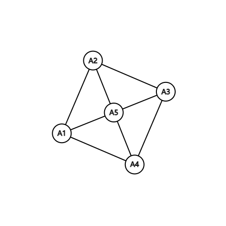
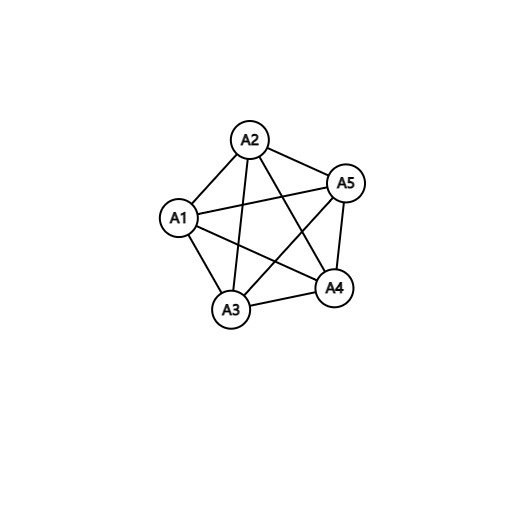
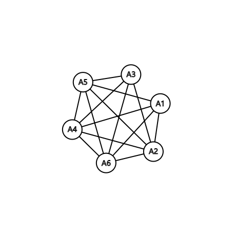
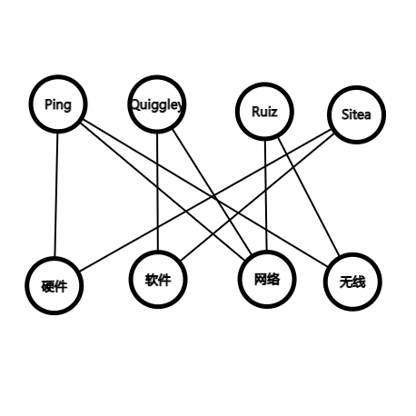

## 5.6
### 3
- a) 不是偏序（不满足自反性）
- b) 是
- c) 是
- d) 不是偏序（不满足自反性）
### 33
- a) 24 45
- b) 3 5
- c) 不存在
- d) 15 45
- e) 15
- f) 15
- g) 3 5 15
- h) 15

### 43
- a) 是
- b) 不是 b,e没有最小上界 f,g没有最大下界
- c) 是

### 49
首先证明 $p_1\preccurlyeq p_2$ 为偏序关系  

自反性：$p\preccurlyeq p$ 对每个划分 p 显然成立  
反对称性：设 $p_1\preccurlyeq p_2$ 且 $p_2\preccurlyeq p_1$ 则有 $\forall T_1\in p_1,\exists T_2\in p_2$，$T_1\subseteq T_2$；对 $\forall T_2'\in p_2,\exists T_1'\in p_1,T_2'\subseteq T_1'$  
可知 $T_1\in p_1$ 与 $T_2\in p_2$ 一一对应（$p_1,p_2$ 为划分各集合之间不变）  

传递性：设 $p_1\preccurlyeq p_2\preccurlyeq p_3$  
对 $\forall T_1\in p_1$ 则 $\exists T_2\in p_2$ 满足 $T_1\subset T_2$；$\exists T_3\in p_3$，$T_2\subseteq T_3$  
即 $T_1\subseteq T_3$ 即 $p_1\preccurlyeq p_3$

因此 $p_1\preccurlyeq p_2$ 为偏序关系  
对 $p_1,p_2$ 其最大下界为 $T_1\in p_1,T_2\in p_2$  
$T_1\cap T_2$ 构成的集合起每一个集合均为 $p_1,p_2$ 中集合的子集  
$p_1,p_2$ 的最小上界为 该等价关系为 $x$ 与 $y$ 等价  
当且仅当 $x=x_1,x_2\dots x_n=y$ $x_i$ 与 $x_{i+1}$ 同属于 $p_1/p_2$ 中的一个元素（集合）

### 67
确定用户需求<写出功能需求<设置测试点<开发系统需求<写文档<开发模块A<开发模块B<开发模块C<模块集成<$\alpha$ 测试<$\beta$ 测试<完成

## 6.1
### 11
假设 $uRv$ 则有与 $\{u,v\}$ 关联的边，即有与 $\{v,u\}$ 关联的边，故有 $\cup Ru$；简单图中没有环结构，故元 $\{u,u\}$ 关联的边 $\forall u,u\not{\texttt{R}} u$

### 13
- a)

- b)

- c)

### 29
令 $S$ 为聚会上的人构成的集合
E 是 $S\times S$ 中 $u$ 知道 $v$ 名字的有序对 $(u,v)$ 的集合  
边是有向的，不允许多重边，存在环

## 6.2
### 5
不存在，无向图中度为技术的顶点应有偶数个

### 27
- a)
    
- b)
  $|N(A)|\ge |A|$    
  $A$ 只有 1 个元素：显然  
  $A$ 只有 2 个元素：$N(A)\ge 3>2=|A|$   
  $A$ 有 3 个元素时任意领域都有 2 个人精通 $|N(A)|=4>3=|A|$
  $A$ 有 4 个元素时，$|N(A)|=4>\ge|A|$  
  存在
- c)
  $\{Ping,\text{网络}\},\{Quiggley,\text{软件}\},\{Ruiz,\text{无线}\},\{Sitea,\text{硬件}\}$

### 33
建立二分图模型 $V_1$ 为 $m$ 个中奖者每人出现两次的集合，其元素为 $2m$ 个每个中奖者需要的奖品  
对 $\forall A\subseteq V_1$, $N(A)$ 为全部 2m 个奖品即 $N(A)=v_2,|N(A)|=|V_2|=2m,|N(A)|=2m\ge A$ 故每个中奖者都能选两个喜欢的奖品

### 47
($\Rightarrow$) 当$d_1, d_2, \cdots , d_n$成图序列时，存在顶点为$v_1, v_2, \cdots , v_n$的简单图$v_1$与$v_2, \cdots , v_{d_1+1}$相邻，去掉$v_1$以及与$v_1$相邻的边，所剩下$v_2, \cdots , v_n$的简单图其度度为$d_2 - 1 \cdots d_{d_1+1}-1 , d_{d_1+2} \cdots d_n$

 ($\Leftarrow$) 对于非递增序列$d_1, d_2, \cdots , d_n$，当序列$d_2-1, d_{d_1+1}-1, d_{d_2+2} , \cdots d_n$重新排列为非递增数列为成图序列$2\leq i \leq d_1+1$时，该序列对应的图中$v_i$的度为$d_i -1$, $\quad d_1+2\leq i \leq n$, $v_i$的度为$d_i$
 
 构造新顶点$v_1$与$v_2, \cdots , v_{d_1+1}$相邻，其度为$d_1$，新的度序列即为$d_1, d_2, \cdots , d_n$
 
### 63
0个顶点的完全图边数为
$$\left( \begin{aligned} v\\2 \end{aligned} \right) = \frac{v(v-1)}{2}$$
 
 $|G|$的边数为$\frac{v(v-1)}{2}-e$
 
### 21
$$\left[\begin{aligned} 1 \quad 1 \quad 2 \quad 1\\1 \quad 0 \quad 0 \quad 2\\1 \quad 0 \quad 1 \quad 1\\0 \quad 2 \quad 1 \quad0\end{aligned}\right]$$
 
### 33
当$v$有环时为$deg(v) - l(v)$，其中$l(v)$为$v$的环数；当$v$无环时为$deg(v)$
 
### 47
$f(u_1) = v_1 \quad f(u_2) = v_2 \quad f(u_3) = v_8 \quad f(u_4) = v_5 \quad f(u_5) = v_6$

$f(u_6) = v_7 \quad f(u_7) = v_4 \quad f(u_8) = v_10 \quad f(u_9) = v_3 \quad f(u_{10}) = v_9$
 
### 49
一个图与自身同构，满足自反性
 
 $G$与$H$同构，即存在$f$为$G$到$H$的一一对应
 
 满足相邻关系不变，$f^{-1}$从$H$到$G$也保持关系不变
 
 $H$与$G$同构，即同构关系是对称的
 
 $G$与$H$同构，$H$与$I$同构，即有$f$，$g$分别保证相邻关系不变
 
 $f$，$g$满足$G$到$I$一一对应且保持相邻关系不变
 
 $G$与$I$同构，得到同构关系是传递的