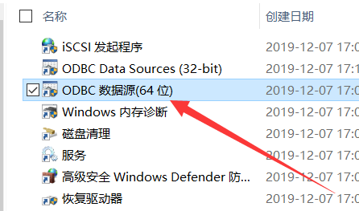

# 数据库exp1-4实验报告

麻治昊 PB18061383

这是一个比较有挑战性的上机实验, 我的实验是在复现了袁老师课上操作基础上完成的. 由于我的电脑和机房, 教室的电脑环境不尽相同, 因此有一部分显示内容可能会有相应的出入.

老师课程链接 ( 我个人录的, 以后会删, 不会传到校外 )  https://rec.ustc.edu.cn/share/506ad3e0-3ddb-11ec-8d8c-e7b307cd6845 .

## 1 熟悉实验环境

### 1.1 ODBC相关配置

-   首先在控制面板内找到管理工具:


-   然后, 我们在管理工具中找到ODBC数据源:



-   打开后, 按照老师的讲述内容, 进行数据源名称 ( Data Source Name, DSN ) 的配置. 由于用户DSN仅对当前用户可见, 而系统DSN对所有用户可见, 因此我们用系统DSN配置.


-   点击添加, 发现弹出驱动选择界面. 这里可以解释为, 我们需要一个数据接口中间件来保证数据库和用户端的互相兼容, 因此我们需要选择驱动. 这里我们选择SQL Server. 另外老师解释了一下Microsoft Access Driver数据库, 是微软的官方数据库; 而Microsoft Access Text Driver是基于文本编辑的数据库 ( Excel里另存为选项可以存储为该形式 ) , Microsoft Access Excel Driver当然也可以作为数据源, 因为Excel本身也是一个表.


-   选择SQL server之后, 我们随便给数据源起一个名字, 描述可以空, 服务器很重要, 需要写科大的数据库地址, 也就是202.38.88.99:1434. 袁老师特别强调, 不能拉服务器右侧的展开箭头, 因为这会导致在局域网内扫描服务器, 会使主机造成卡顿.


-   接下来, 我们点击下一页进入下一步. 首先我们选择登录方式, 这里我们选择第二种方式. 这两种方式里, Windows NT是Windows服务器内核的一种验证方式, 以用户本身系统账号来验证用户; 而用户自行输入验证可以连接远程的数据库, 因为远程数据库无法承认我们本地用户的合法性. 而登录的账号密码都是 " student " 七个字符.


-   下两个界面, 我们直接默认即可.


-   接下来完成, 我们会得到一个返回信息, 测试数据源发现成功:


-   到此, 我们连接好了一个数据源, 可以用于做实验了.

### 1.2 MySQL相关配置

-   如果用MySQL做实验的话, 我们需要用MySQL数据库. 但是在图1.1.4中我们没有发现有MySQL相关驱动, 因此我们需要在课程主页[http://staff.ustc.edu.cn/~ypb/](http://staff.ustc.edu.cn/~ypb/)中下载. 


我们不用SQL Server, 因为它有一些自己集成的内容, 对本实验兼容较差; 而Oracle数据库过于庞大, 不适合在教学中使用. 我们下载好之后, 双击打开运行一路默认选项即可.


-   这时候我们回到ODBC数据源, 会发现在添加数据源中多了一个MySQL ODBC 3.51 Driver选项, 这就是我们要的结果.


-   接下来, 从老师课程主页下载实验数据, 也就是MySQL|5.027数据库(含测试数据), 如图所示:


-   解压到C盘根目录下 ( 这里建议实验结束后删掉 ) , 然后运行如图所示程序, 输入本机用户的用户名和密码之后, 如果是绿灯, 则说明正常运行.


-   接下来就要在OBDC数据源里添加相应的数据库了. 选择MySQL ODBC 3.51 Driver, 然后进行如下配置. 该数据库的用户名是root, 密码是空, OK即可.


-   这样, MySQL也配置好了, 我们可以进行使用.

### 1.3 进行测试

-   从课程主页下载SQLDbx进行测试数据库, 如图所示:


-   按照如图所示配置好数据库连接, 注意这里选项增多, 不要输错.


-   连接成功, 如图所示:


-   然后我们再连接一下本地数据库试一试, 发现也连接成功.


-   测试通过, 我们配置好之后可以使用数据库.

### 1.4 利用数据库开发应用程序

-   老师说由于进度不匹配, 第一次实验暂时跳过oracle Proc预编译环境, 直接进行Delphi C++示例代码阅读学习.

-   安装Delphi, 注意破解以及目录粘贴.

    

-   Delphi无法在Win10中正常运行, 最后通过授予管理员权限解决.

## 2 查询

### 2.1 代码总览

-   代码如下, 先上全部代码, 而后展示一些有难度或有坑点的题目的截图. 

-   由于我使用SqlDbx进行实验, 对大小写不敏感, 因此为书写方便, 代码全用小写进行.
-   另外, 我发现该语言对各种空白字符比如空格, tab, 换行是一视同仁的, 因此为保证格式美观且易于查看, 自行增加了若干tab键, 各种语句之间用分号 " ; " 分隔.

```sql
-- 1. 无条件查询
	-- 1. 查找pubs库中authors表全部信息
		select * 
			from authors;
			
	-- 2. 查找其他样例表中全部信息: sales, titles, employee, publishers
		select *
			from sales;
			
		select *
			from titles;
			
		select *
			from employee;
			
		select *
			from publishers;
			
-- 2. 简单条件查询
	-- 1. 查找titles表中全部书号及书名
		select title_id, title
			from  titles;
			
	-- 2. 查找titles表中价格在$10~15元之间的书的书名
		select title
			from titles 
			where price between 10 and 15;
			
	-- 3. 查找titles表中书名以T开头的书号, 书名
		select title_id, title
			from titles
			where title like 'T%';
			
	-- 4. 对authors样例表构造一个简单查询条件进行查询
		-- 查询区号是415开头电话的作者全部信息
		select *
			from authors
			where phone like '415%';
			
-- 3. 多条件查询
	-- 1. 查找书名起始字符为T, 价格小于$16的书名及价格
		select title, price
			from  titles
			where title like 'T%'
				and price<16;
			
	-- 2. 查找书名起始字符不为T的, 价格大于$16的书号, 书名及价格
		select title_id, price
			from  titles
			where title not like 'T%'
				and price>16;
			
	-- 3. 列出已出售书的书号和数量
		select title_id, ytd_sales
			from  titles
			where ytd_sales>0;
			
	-- 4. 对publishers样例表构造一个多条件查询, 进行查询
		-- 查找国家在USA且出版社号以0开头的所有出版商的名字
		select pub_name
			from  publishers
			where country='USA'
				and pub_id like '0%';
			
-- 4. 使用函数进行查找
	-- 使用titles表进行查找
	-- 1. 列出有多少种类型的书
		select count(distinct type)
			from titles;
			
	-- 2. 列出书的定价有多少种
		select count(distinct price)
			from titles;
			
	-- 3. 查出书价最高的书价
		select max(price)
			from titles;
			
	-- 4. 列出当年销量的总和
		select sum(ytd_sales)
			from titles;
			
	-- 5. 计算这些书籍的最高书价, 最低书价及平均书价
		select max(price), min(price), avg(price)
			from titles;
			
	-- 6. 按出版社号分组, 列出各个出版社当年销量的总和
		select pub_id, sum(ytd_sales)
			from titles
			group by pub_id;
			
	-- 7. 计算不同的书名共有多少种
		select count(distinct title)
			from titles;
			
	-- 8. 对样例表sales构造一个统计查询, 给出查询结果
		-- 查找发行日期最早的书的发行时间
		select min(ord_date)
			from sales;
			
-- 5. 得到排序的查询结果
	-- 1. 查找作者的姓, 名, 电话号码, 并按作者姓, 名排列
		select au_lname, au_fname, phone
			from authors
			order by au_lname, au_fname;
			
	-- 2. 查找书名和书的价格, 按书价由大到小的次序排列
		select title, price
			from titles
			order by price desc;
			
	-- 3. 列出烹调书, 它们数量和该类的平均价格
		select count(distinct type), avg(price)
			from titles
			where type like '%cook%';
			
	-- 4. 对其他样例表构造查询条件, 排序要求, 给出查询结果
		-- 升序排列employee的emp_id并输出全部信息
		select *
			from employee
			order by emp_id ;
			
-- 6. 用嵌套或连接进行查询
	-- 1. 使用样例表titles, publishers查找出版社的名称以及所出的书名
		select pub_name, title 
			from titles, publishers
			where titles.pub_id=publishers.pub_id;
			
	-- 2. 使用样例表authors, titleauthor, titles查找作者的姓、名和所写的书名
		select au_lname,au_fname,title 
			from authors, titleauthor, titles
			where authors.au_id=titleauthor.au_id 
				and titleauthor.title_id=titles.title_id;
      	
	-- 3. 从titles, sales中找出定单量最大的那一行定单的书的书名, 价格, 定单量
		select title,price,qty
			from titles, sales
			where titles.title_id=sales.title_id
				and qty=
        (
          select max(qty)
            from  sales
        )

	-- 4. 构造其他条件, 在sales和stores样例表中进行连接或嵌套查询
		-- 对每个书店以销售数量为关键字降序排序书店编号, 书店名称和销售总数量
		select stor_id, sum(qty) qty_sum
			into #temp
			from sales
			group by stor_id;
			
		select stores.stor_id, stores.stor_name, qty_sum
			from stores, #temp
			where stores.stor_id=#temp.stor_id
			order by qty_sum desc;
			
		drop table #temp;
```

### 2.2 部分代码的运行结果

-   3.4题, 我当时对字符串匹配这一点疏忽了, 用如下代码死活不出结果, 最后才想起来换成like. 这两个代码就相差个等号和like.

```sql
-- 修改前的错误代码
select pub_name
	from  publishers
	where country='USA'
		and pub_id='0%';
	
-- 修改后的正确代码
select pub_name
	from  publishers
	where country='USA'
		and pub_id like '0%';
```

-   3.5题, 我当时忘记加distinct了, 导致输出结果是整个title表的行数, 后来加入distinct去重, 输出结果正常. 被自己蠢哭, 对比如下:


-   6.4题, 纯属没事找事, 我编了一个比较奇葩的问题. 一开始感觉可能通过现有知识做出了, 但是还是我太天真了, from里不能嵌套查找出来的表格的. 于是通过百度相关内容得到了答案. 首先我发现需要临时建立一个表格, 然后根据临时表格来进行操作, 最后删除临时表格.

```sql
-- 对每个书店以销售数量为关键字降序排序书店编号, 书店名称和销售总数量
  -- 百度上通过子查询方式建立临时表格
  select stor_id, sum(qty) qty_sum
    into #temp
    from sales
    group by stor_id;
  -- 常规操作
  select stores.stor_id, stores.stor_name, qty_sum
    from stores, #temp
    where stores.stor_id=#temp.stor_id
    order by qty_sum desc;
  -- 删除表格, 不影响后面操作
  drop table #temp;
```

​		我的输出结果如下图所示:


## 3 建表

### 3.1 代码总览

-   和上次类似, 先上代码然后解说.

```sql
-- 1. 手动建表
	-- 1. 先建立一个表T的前五个属性以及另一个表S
    create table TPB18061383
    (
      书名 char(50),
      作者 char(20),
      书号 char(10),
      价格 numeric(5,2),
      出版社 char(20)
    );
    
    create table SPB18061383
    (
      书号 char(10),
      页数 smallint,
      库存量 smallint,
      仓库号 smallint
    );
  
  -- 2. 手动添加T最后一个属性
    alter table TPB18061383
      add 出版时间 numeric(4);

	-- 3. 依次插入T和S的数据
    insert into TPB18061383
    	values
    	(
        '计算机原理',
        '张一平',
        'S3092',
        '20.80',
        '中国科技大学',
        1986
      );
      
    insert into TPB18061383
    	values
    	(
        'C语言程序设计',
        '李华',
        'H1298',
        '15.30',
        '电子工业',
        1993
      );
      
    insert into TPB18061383
    	values
    	(
        '数据库原理',
        '王家树',
        'D1007',
        '22.70',
        '高等教育',
        1987
      );

    insert into TPB18061383
    	values
    	(
        '计算机网络',
        '高明',
        'S5690',
        '18.90',
        '高等教育',
        1993
      )

    insert into TPB18061383
    	values
    	(
        'Artificial intelligence',
        'P.Winston',
        'D2008',
        '20.50',
        '电子工业',
        1989
      );
      
    insert into TPB18061383
    	values
    	(
        'Expert systems',
        'R.Ullman',
        'H3067',
        '17.00',
        '清华大学',
        1994
      );
      
    insert into TPB18061383
      values
      (
        '软件工程',
        '鲁廷璋',
        'S2005',
        '35.00',
        '中国科技大学',
        1995
      );
      
    insert into TPB18061383
    	values
    	(
        'Fortran程序设计',
        '顾学峰',
        'S5006',
        '18.00',
        '高等教育',
        1995
      );
      
    insert into SPB18061383
      values
      (
        'S3092',
        304,
        300,
        1
      );

    insert into SPB18061383 
      values
      (
        'D1007',
        280,
        200,
        3
      );

    insert into SPB18061383
      values
      (
        'S5006',
        315,
        240,
        2
      );

    insert into SPB18061383
      values
      (
        'S5690',
        300,
        300,
        2
      );

    insert into SPB18061383
      values
      (
        'H1298',
        210,
        470,
        5
      );

    insert into SPB18061383
      values
      (
        'D2008',
        358,
        342,
        2
      );

    insert into SPB18061383
      values
      (
        'S2005',
        298,
        200,
        2
      );

    insert into SPB18061383
      values
      (
        'H3067',
        307,
        510,
        1
      );
        
-- 2. 用子查询方式建表ST
	select 书名,价格
		into STPB18061383
		from TPB18061383;
		
-- 3. 按书号建索引IT
	create index ITPB18061383
		on TPB18061383
		(
    	书号
    );
		
-- 4. 用子查询方式建视图VT, 并查找相应信息
	-- 最高价格的书名
	create view VTPB18061383 
	(
    最高价格的书名
  )
  	as select 书名
      from TPB18061383
      where 价格=
      (
        select max(价格)
          from TPB18061383
      );
        
-- 5. 删除ST表
	drop table STPB18061383;
	
-- 6. 删除VT视图
	drop view VTPB18061383;
	
-- 7. 删除IT索引
	drop index TPB18061383.ITPB18061383;
	
-- 8. 对T和S建索引与视图各一个
	-- 对T按书名建立索引IT
	create index ITPB18061383
		on TPB18061383
		(
    	书名
    );
    
	-- 对T建立书名和出版社视图VT
	create view VTPB18061383 
	(
    书名,
    出版社
  )
  	as select 书名, 出版社
    	from TPB18061383;
        
	-- 对S按书号建立索引IS
	create index ISPB18061383
		on SPB18061383
		(
    	书号
    );
    
	-- 对S建立书号和仓库号视图VS
	create view VTPB18061383 
	(
    书号,
    仓库号
  )
  	as select 书号, 仓库号
			from SPB18061383;
```

### 3.2 部分代码的运行结果

-   7题, 我一开始没有想到索引需要用表名, 导致删除失败. 但是讲义里说可以不写表名的, 这就很奇怪了.

```sql
-- 修改前的错误代码
drop index ITPB18061383;
	
-- 修改后的正确代码
drop index TPB18061383.ITPB18061383;
```


## 4 插入, 删除, 更新与存储过程

### 4.1 代码总览

-   和上次类似, 先上代码然后解说.

```sql
-- 1. 在 T** 表中插入一元组, Digital Image Processing, S7028, 36.00
	insert into TPB18061383
	(
    书名,
    书号,
    价格
  )
  	values
  	(
      'Digital Image Processing',
      'S7028',
      '36.00'
    );
    
-- 2. 删除书名为Fortran程序设计的那个元组
	delete from TPB18061383
		where 书名='Fortran程序设计';
		
-- 3. 删除书号以H开头的元组
	delete from TPB18061383
		where 书号 like 'H%';
		
-- 4. 把书价调整到原来价格的90%
	update TPB18061383
		set 价格=价格*0.9;
		
-- 5. 把书号以D开头的那些书的书价减掉2.00元
	update TPB18061383
		set 价格=价格-2
		where 书号 like 'D%';
		
-- 6. 将计算机原理的书号改为S1135
	update TPB18061383
		set 书号='S1135'
		where 书名='计算机原理';
		
-- 7. 对所建的表, 进行其他插入, 删除, 更新操作各一个
	-- 插入书籍网络空间安全大礼包, 作者麻治昊, 价格1.00, 出版社gitee.com/yssickjgd
	insert into TPB18061383
	(
  	书名,
    作者,
    价格,
    出版社
  )
		values
		(
      '网络空间安全大礼包',
      '麻治昊',
      '1.00',
      'gitee.com/yssickjgd'
    );
    
	-- 删除所有高等教育出版社的书
	delete from TPB18061383
		where 出版社='高等教育';
		
	-- 更新所有价格不小于15元的书籍为半价
	update TPB18061383
		set 价格=价格*0.5
		where 价格>=15;
		
-- 8. 建立gpa映射关系
	-- 输入参数为百分制成绩, 返回绩点, 等级成绩
	-- 输入成绩不在0到100存储过程返回-1, 否则返回0
	-- 声明过程
	create procedure PB18061383
		@fz int,
		@jd varchar(5) output,
		@djcj varchar(5) output
		as begin
			if @fz<0
				or @fz>100
				return -1
			select @jd=jd,@djcj=djcj
        from pubs..cjdzb
        where ceiling(@fz)>=startfz
        and ceiling(@fz)<=endfz
			return 0
		end;
	
	-- 执行过程
	declare @jd varchar(5), @djcj varchar(5);
	execute PB18061383 83.4, @jd output, @djcj output;
	select @jd jd, @djcj djcj;
```

### 4.2 部分代码的运行结果

-   8题, 和前几题题型不一样, 在这里详细解释一下. 它的代码格式和之前的静态SQL语句不太一样. 用create procedure来建立一个"函数"类似的过程, 然后declare声明变量, execute执行, 最后用select展示出结果. 而且或许是语言特性, 声明过程和执行过程的两段代码如果同时传过去, 代码会因为重复定义参数而报错; 若分开传过去, 则代码正常运行. 或许SQL语言对形参实参的概念和C语言的不尽相同. 相关报错信息如图所示:


