# 数据库exp5实验报告

麻治昊 PB18061383

由于在第一次实验就复现了袁老师所有的环境配置内容, 因此现在都具备了所有的实验环境.

老师课程链接 ( 我个人录的, 以后会删, 不会传到校外 )  https://rec.ustc.edu.cn/share/506ad3e0-3ddb-11ec-8d8c-e7b307cd6845 .

## 1 在袁老师课上带领下熟悉界面

-   首先, 熟悉如何修改窗体名字

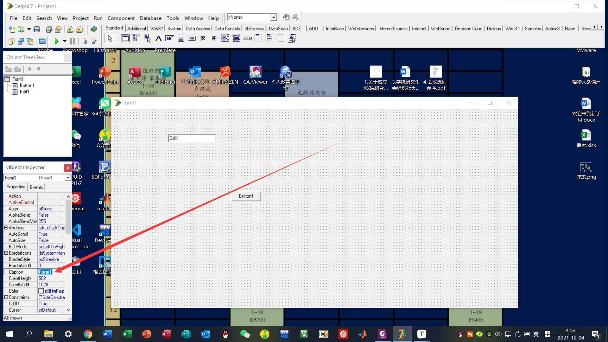

-   然后, 在如图所示界面放置一个输入框和一个按键, 并双击按键后在弹出的代码窗口输入. 运行后会出现一个提示OK的弹窗.

```pascal
showmessage('OK')
```


-   之后是最最重要的内容, 那就是Delphi如何访问数据库. 
-   另外, 要记住在控制面板的ODBC数据源那里从用户方向建立一个数据库, 系统数据库是无法显示的.

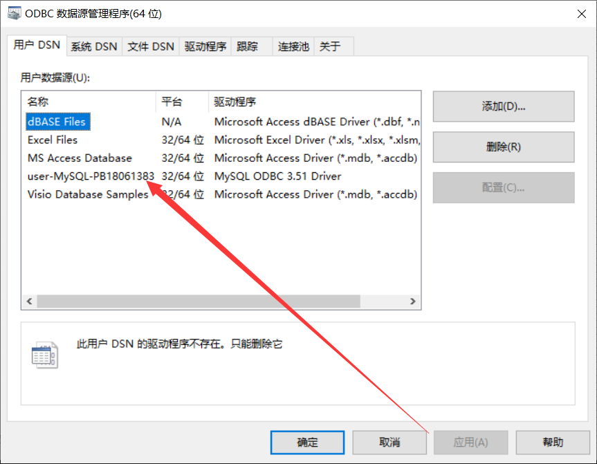

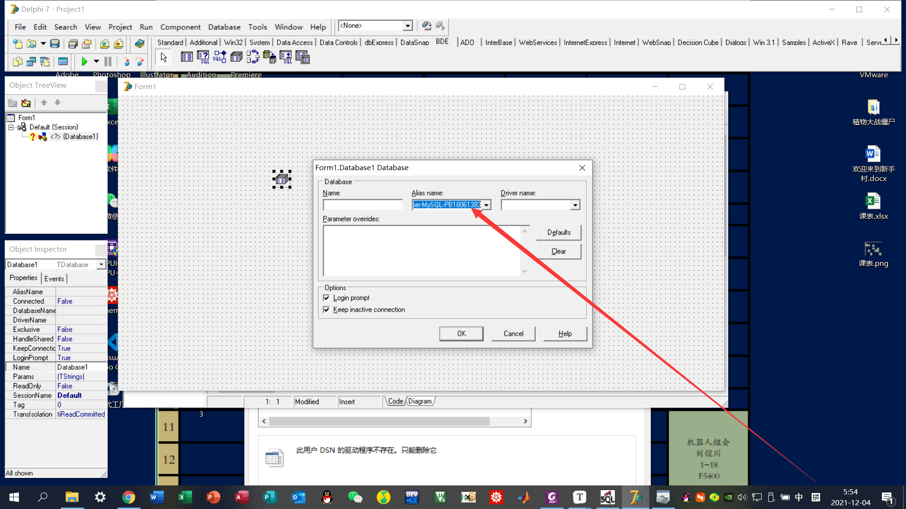

-   配置BDE中的Database, 找到AliasName, 点default, 输入数据库相关信息, 即数据库名, 用户名, 顺便取消后续密码输入节省时间. 再在外面给这个数据库命名.

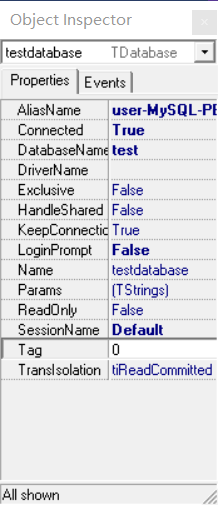

-   继续配置Table的相关信息, 这里需要把DatabaseName指向Database的DatabaseName, 相当于被引用. 然后配置TableName和Active参数.

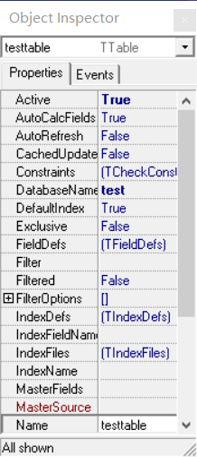

-   继续配置DataAccess中的DataSource相关信息, 这里相当于一个管道, 所有的数据都从Database到Table再到Datasource. 它需要配置DataSet参量.

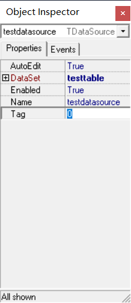

-   继续配置DataControl中的DBGrid相关信息, 也就是一个展示空间. 当然要配置DataSource参量.

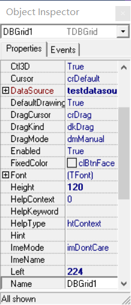

-   由于该应用默认没有中文, 因此切换表到不含英文的表, 运行后结果如图.

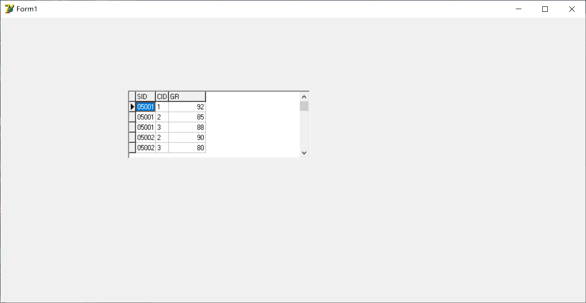

-   实现按钮显示功能, 把table设置成false， 然后对按键输入代码.

    ```pascal
    testtable.Active:=true
    ```

-   接下来目标, 把数据库应用改进. 即改进查询, 利用BDE中的Query. Query和Table是平级的, 两者都属于DataSet. Query是通过语句实现的, 即把TableName替换成了SQL语句. 用Query拿出来的如图所示.

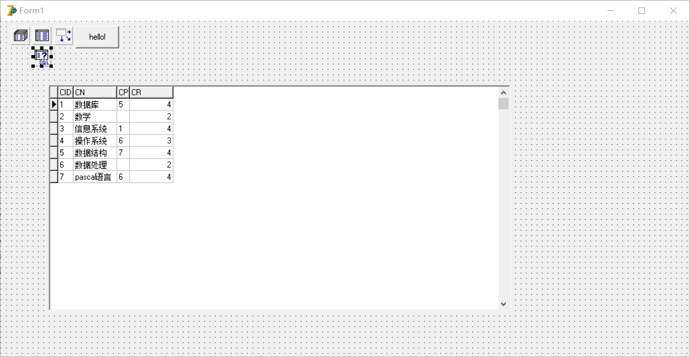

-   然后发现一个问题, 我们运行的时候就已经定好了要输出什么. 那么我们能不能在运行之后决定更大灵活性地输入.

-   利用Standard中的Memo实现传SQL代码, 输入如下代码.

    ```pascal
    testquery.Close;
    testquery.SQL.Text:=testmemo.Text;
    testquery.Open
    ```

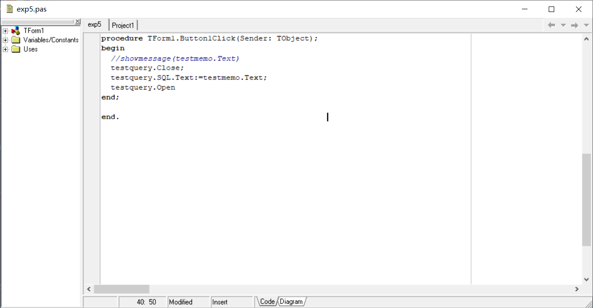

-   示例如下.

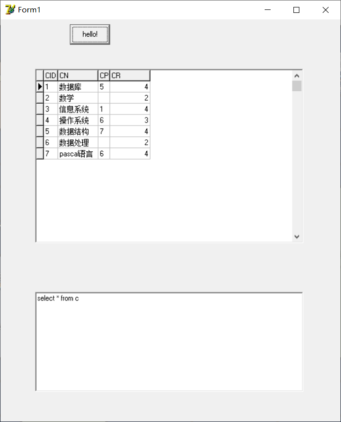

## 2 开始实验, 选做实验一

-   先决条件, 在本地和ODBC匹配的test数据库下建立一个属性表, 名字是 PB18061383_exp5 , 然后初始化两个数据作为示例, 然后才能进行实验. 代码如下.

    ```sql
    create table PB18061383_exp5
    (
    	bookserial char(10) not null,
    	bookname char(30),
    	author char(20),
    	PRIMARY KEY (bookserial)
    );
    
    insert into PB18061383_exp5
    	values
    	(
        'S3092',
    		'Computer Networks',
        'Someone'
      );
    
    insert into PB18061383_exp5
    	values
    	(
        'H1298',
        'C++ Primer Plus',
        'Somebody'
      );
    ```

-   输出如图所示

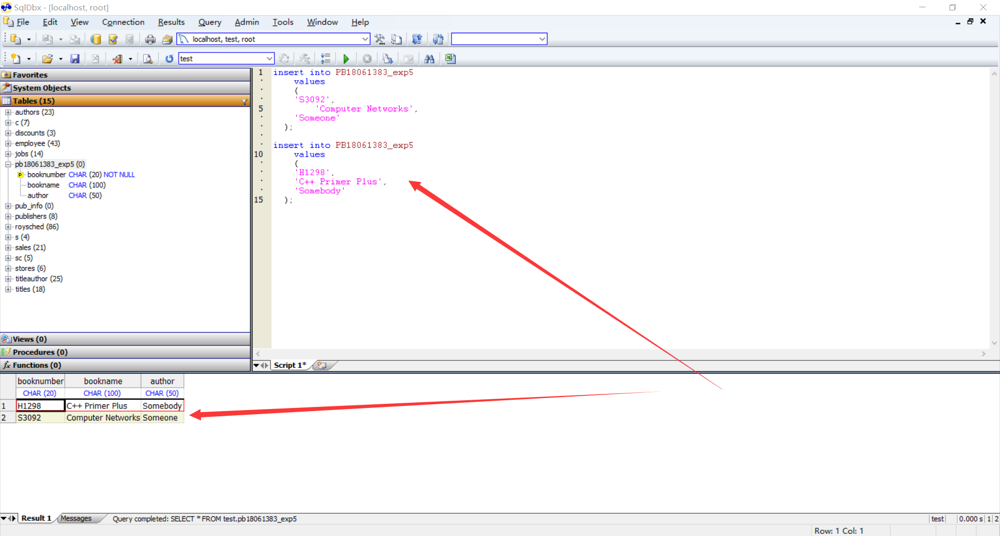

-   然后, Pascal编辑器上的部分核心代码如下.

    ```pascal
    var
      Input: ansistring;
      
    procedure TForm1.Button1Click(Sender: TObject);
    begin
      Input:='select * from PB18061383_exp5 where true ';
      if(length(input_bookname.Text)>0)
      then Input:=Input+'and bookname like '''+input_bookname.Text+''' ';
      if(length(input_author.Text)>0)
      then Input:=Input+'and author like '''+input_author.Text+''' ';
      if(length(input_bookserial.Text)>0)
      then Input:=Input+'and bookserial like '''+input_bookserial.Text+''' ';
      testquery.Close;
      testquery.SQL.Text:=Input;
      testquery.Open;
    end;
    
    procedure TForm1.Button2Click(Sender: TObject);
    begin
      Input:='insert into PB18061383_exp5 values( '+''''+input_bookserial.Text+''', NULL, NULL);';
      testquery.Close;
      testquery.SQL.Text:=Input;
      testquery.ExecSQL;
      if(length(input_bookname.Text)>0)
      then Input:='update PB18061383_exp5 set bookname='''+input_bookname.Text+''' '+'where bookserial like '+''''+input_bookserial.Text+''';';
      testquery.Close;
      testquery.SQL.Text:=Input;
      testquery.ExecSQL;
      if(length(input_author.Text)>0)
      then Input:='update PB18061383_exp5 set author='''+input_author.Text+''' '+'where bookserial like '+''''+input_bookserial.Text+''';';
      testquery.Close;
      testquery.SQL.Text:=Input;
      testquery.ExecSQL;
    end;
    
    procedure TForm1.Button3Click(Sender: TObject);
    begin
      Input:='delete from PB18061383_exp5 where false ';
      if(length(input_bookname.Text)>0)
      then Input:=Input+'or bookname like '''+input_bookname.Text+''' ';
      if(length(input_author.Text)>0)
      then Input:=Input+'or author like '''+input_author.Text+''' ';
      if(length(input_bookserial.Text)>0)
      then Input:=Input+'or bookserial like '''+input_bookserial.Text+''' ';
      testquery.Close;
      testquery.SQL.Text:=Input;
      testquery.ExecSQL;
    end;
    
    procedure TForm1.Button4Click(Sender: TObject);
    begin
      if(length(input_bookname.Text)>0)
      then Input:='update PB18061383_exp5 set bookname='''+input_bookname.Text+''' '+'where bookserial like '+''''+input_bookserial.Text+''';';
      testquery.Close;
      testquery.SQL.Text:=Input;
      testquery.ExecSQL;
      if(length(input_author.Text)>0)
      then Input:='update PB18061383_exp5 set author='''+input_author.Text+''' '+'where bookserial like '+''''+input_bookserial.Text+''';';
      testquery.Close;
      testquery.SQL.Text:=Input;
      testquery.ExecSQL;
    end;
    ```

-   代码部分解释

    -   主键是书号, 对应名称是bookserial, 其余的是常规属性, 都是字符串类型
    -   首先声明了一个超长字符串变量Input, 因为普通的string长度有255限制, 因此我用超长字符串一劳永逸
    -   然后是对四个button的函数撰写, 函数 ( 应该是过程, 但C语言后遗症感觉这个挺像函数的 ) 声明格式是百度到的

-   界面如下, 这四个按键, 分别对应查询, 插入, 删除, 更新功能.

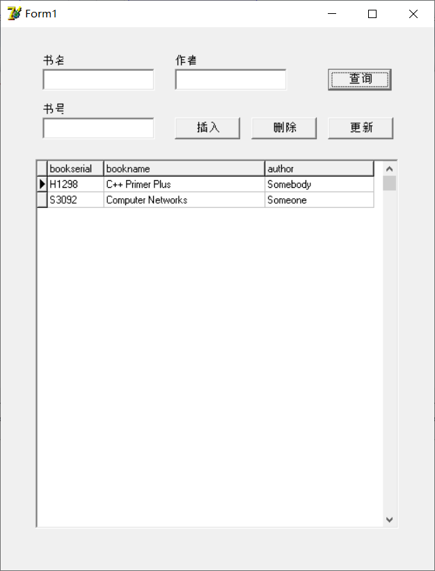

-   查询为条件之间的与关系, 而且支持通配符, 支持空输入 ( 也是因为SQL本身支持 ) .

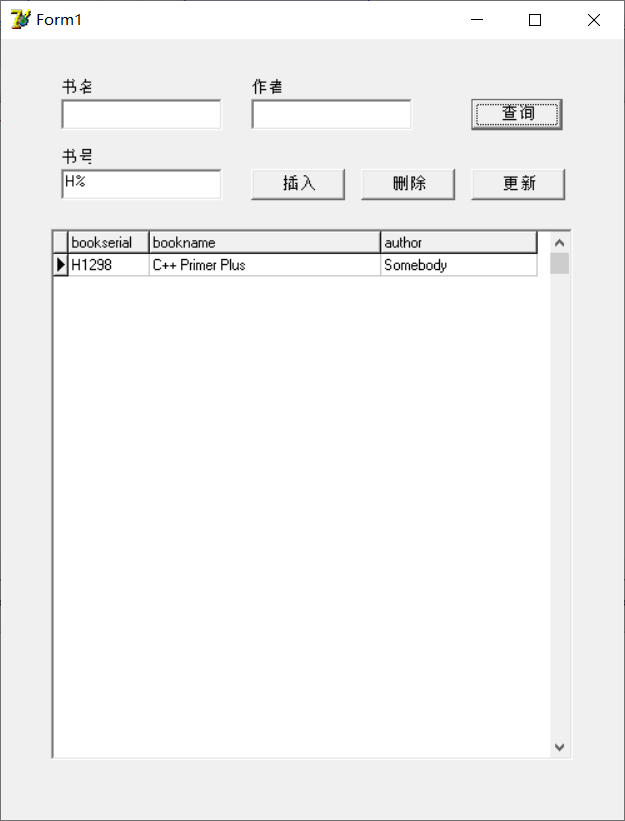

-   插入我分成了两步, 第一步是生成主键, 第二步是插入其他属性, 这样的好处是利于字符串的编辑.

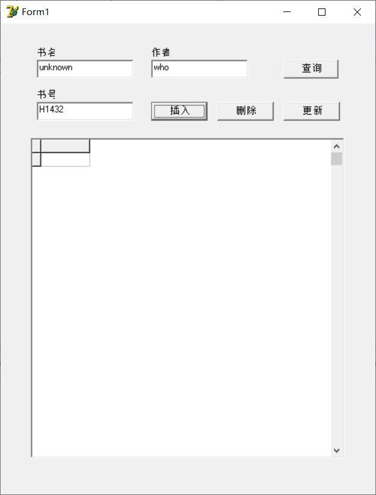

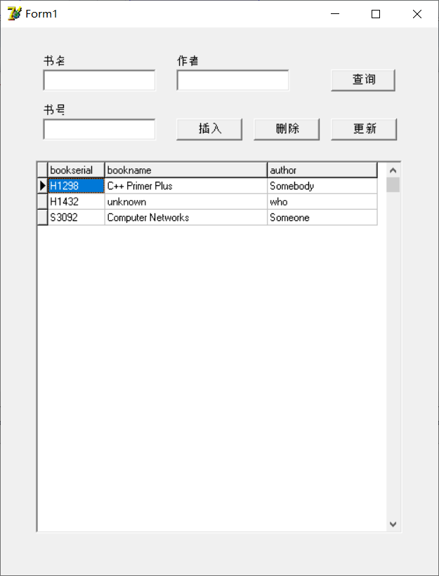

-   删除为或关系, 而且也支持通配符.

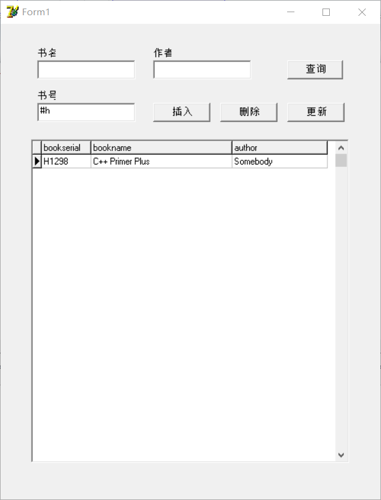

-   更新是顺着插入的后半功能直接移植的, 很容易实现. 几乎就是把插入的后半段代码完全复制粘贴下来就可以了.
-   百度真的很管用.
    -   这个软件经常有莫名其妙的bug, 我通过百度报错码, 以及逐行逐句debug, 更深入学习了Pascal语言.
    -   Pascal处理字符串真的很不错, 而且变量声明也和常规的先类型后名称相反.
    -   Pascal的分号和C语言不太一样, 有些地方没有严格要求.
-   然后, 就是感觉第二个选做内容本质上和第一个选做实验是一样的, 只是工作量大了一些.