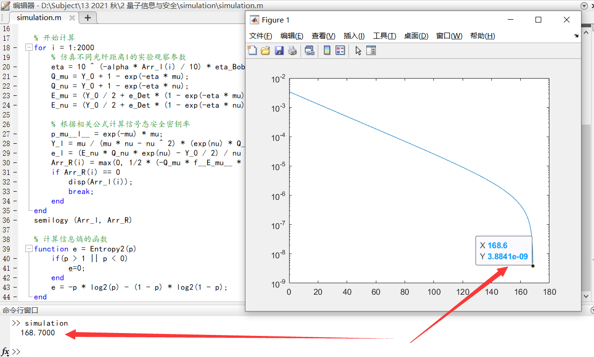
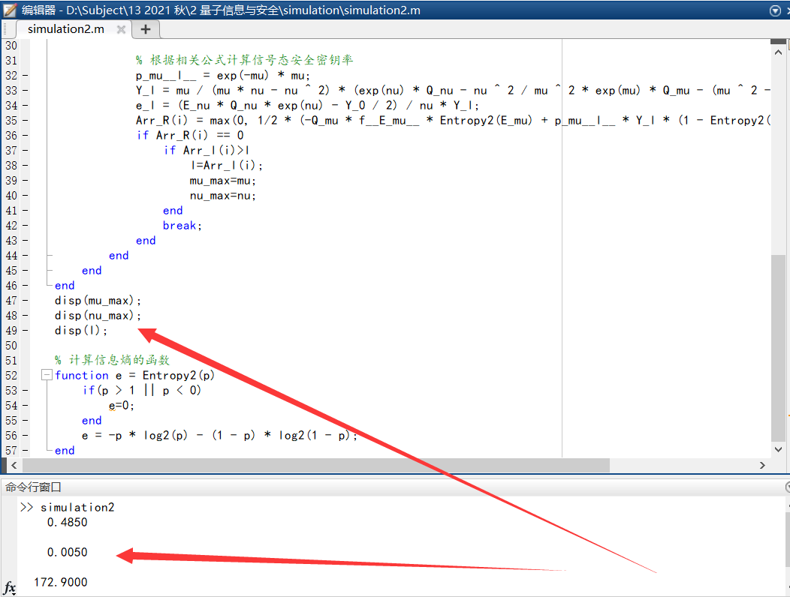

# 诱骗态BB84量子密码系统仿真

姓名: 麻治昊

学号: PB18061383

## 实验概述

-   实验要求
    -   根据给定的实验系统的参数, 对采用诱骗态方案的BB84系统进行仿真, 得到在不同光纤传输距离l下，系统安全密钥生成率R
    -   实验结果需给出程序和计算结果的作图. 作图要求横坐标为光纤长度l ( km ) , 范围至少覆盖从0km至安全密钥率R降至趋于0的距离; 纵坐标为每个信号态光脉冲的安全密钥生成率R, 采用对数坐标, 单位为bit/pulse
    -   通过仿真研究信号态平均光强$\mu$, 诱骗态平均光强$\nu$设置为什么值时，得到的安全密钥分发距离最长
-   实验组成部分
    -   实验原理
        -   量子密码的安全性
        -   PNS攻击
        -   GLLP公式
        -   诱骗态方案理论
    -   仿真部分
        -   参考数据与公式
        -   实验代码
        -   运行结果
        -   结论
    -   选做部分附加材料
        -   实验代码
        -   运行结果
        -   结论

## 实验原理

-   量子密码的安全性

    量子密码的安全性分为理论安全性与实际安全性. 两者对比如下表所示:

    |   条件   |          光源           |        量子态制备        |     信道     |                             探测                             |
    | :------: | :---------------------: | :----------------------: | :----------: | :----------------------------------------------------------: |
    | 理想模型 |        单光子源         |         完美制备         | 有损有噪信道 |                         Qubit探测器                          |
    | 实际缺陷 |       光源不完美        |      有损有误差制备      |              |                   阈值甄别模式单光子探测器                   |
    | 实际模型 | PNS攻击, 利用诱骗态解决 | 考虑非完美态制备安全分析 |              | 强光致盲攻击; 波长攻击; 死时间攻击; 后脉冲攻击; 伪态攻击; 时移攻击 |

-   PNS攻击

    光子数分离 ( Photon Number Splitting, PNS ) 攻击, 具体过程如下所示:

    -   假定Alice和Bob利用相位随机化的弱相干态光源进行BB84协议, 攻击者为Eve
    -   第一步: Eve探测每个脉冲的光子数, 同时不破坏光子的量子态. 这是有量子力学理论支撑的合理操作
    -   第二步: Eve阻挡单光子脉冲, 把多光子脉冲的一部分通过一个损耗理想化的信道发送给Bob, 另一部分Eve自己留存. 这里我们假定Eve有量子存储能力
    -   第三步: Eve等待Alice和Bob公布基信息后, 按照基信息来测量自己保存的单光子

    这样下来, Eve可以获得所有信息且理论上没有误码

    -   关键公式:

        $\eta<\frac{1-e^\mu-\mu e^{-\mu}}{\mu e^{-\mu}}$

-   GLLP公式

    对于存在多光子事件的光源, 只有其中的单光子发射事件才能生成安全的密钥. 在采用弱相干态光源的实际QKD系统中, 可以使用该公式的计算最终安全密钥生成率

    -   关键公式

        $R>q(p_\mu(l) Y_l (1-H_2(e_1))-Q_\mu f(E_\mu) H_2(E_\mu))$

-   诱骗态方案理论

    -   定义: 

        计数率$Y_n$, 是当Alice发送n光子态时, 接收方得到探测结果并生成1bit密钥的概率

    -   目标: 

        设计一个方法用来测试多光子的计数率

    -   方法:

        用双光子态作为诱骗态测试双光子的计数率, 并与无分束攻击模型下的双光子计数率进行比较

    -   问题:

        实际系统很难有理想双光子态, 而且Eve可以用三光子攻击

    -   解决方法:

        利用光强调制器随机调制激光脉冲为两种不同的光强的光脉冲. 其中一个平均光子数是$\mu$, 是信号态; 另一个平均光子数是$\nu$, 是诱骗态. 通过观察两种光脉冲的探测概率来发现攻击

## 仿真部分

-   参考数据与公式

    |          参数名称           |       数值       |
    | :-------------------------: | :--------------: |
    |    光纤信道损耗$\alpha$     |    0.21 dB/km    |
    |      背景噪声计数$Y_0$      | 8.5*10^-7 /gate  |
    | 接收端探测效率$\eta_{Bob}$  |      0.045       |
    | 错误探测信号的几率$e_{Det}$ |       3.3%       |
    |     信号态平均光强$\mu$     | 0.6 photon/pulse |
    |     诱骗态平均光强$\nu$     | 0.2 photon/pulse |
    |     纠错效率$f(E_\mu)$      |       1.22       |

    -   首先仿真不同光纤距离l下实验观察参数

        $\eta=10^{-\frac{\alpha l}{10}}\eta_{Bob}$

        $Q_\mu=Y_0+1-e^{-\eta\mu}$

        $Q_\nu=Y_0+1-e^{-\eta\nu}$

        $E_\mu Q_\mu=\frac{Y_0}{2}+e_{Det}(1-e^{-\eta \mu})$

        $E_\nu Q_\mu=\frac{Y_0}{2}+e_{Det}(1-e^{-\eta \nu})$

    -   然后根据上述参数计算信号态安全密钥率R

        $p_\mu(l)=e^{-\mu} \mu$

        $Y_l^L=\frac{\mu}{\mu \nu-\nu^2}(e^\nu Q_\nu-\frac{\nu^2}{\mu^2} e^\mu Q_\mu-\frac{\mu^2-\nu^2}{\mu^2}Y_0)$

        $e_l^U=\frac{E_\nu Q_\nu e^\nu-\frac{Y_0}{2}}{\nu Y_l^L}$

        $R=\frac{1}{2}(-Q_\mu f(E_\mu) H_2(E_\mu)+p_\mu(l)Y_l^L(1-H_2(e_l^U)))$

        -   注意, 如果R为负数, 则取0

-   实验代码

    simulation1.m

    ```matlab
    % 仿真实验系统的参数
    alpha = 0.21;       %光纤信道损耗;      dB/km
    Y_0 = 8.5*10^-7;    %背景噪声计数;      /gate
    eta_Bob = 0.045;    %接收端探测效率;
    e_Det= 3.3*10^-2;   %错误探测信号几率;
    mu = 0.6;           %信号态平均光强;    photon/pulse
    nu = 0.2;           %诱骗态平均光强;    photon/pulse
    f__E_mu__ = 1.22;   %纠错效率;
    
    % 自行填补数据
    Arr_l = zeros(1, 2000);
    Arr_R = zeros(1, 2000);
    for i = 1:2000
        Arr_l(i) = i * 0.1;
    end
    
    % 开始计算
    for i = 1:2000
        % 仿真不同光纤距离l的实验观察参数
        eta = 10 ^ (-alpha * Arr_l(i) / 10) * eta_Bob;
        Q_mu = Y_0 + 1 - exp(-eta * mu);
        Q_nu = Y_0 + 1 - exp(-eta * nu);
        E_mu = (Y_0 / 2 + e_Det * (1 - exp(-eta * mu))) / Q_mu;
        E_nu = (Y_0 / 2 + e_Det * (1 - exp(-eta * nu))) / Q_nu;
    
        % 根据相关公式计算信号态安全密钥率
        p_mu__l__ = exp(-mu) * mu;
        Y_l = mu / (mu * nu - nu ^ 2) * (exp(nu) * Q_nu - nu ^ 2 / mu ^ 2 * exp(mu) * Q_mu - (mu ^ 2 - nu ^ 2) / mu ^ 2 * Y_0);
        e_l = (E_nu * Q_nu * exp(nu) - Y_0 / 2) / nu * Y_l;
        Arr_R(i) = max(0, 1/2 * (-Q_mu * f__E_mu__ * Entropy2(E_mu) + p_mu__l__ * Y_l * (1 - Entropy2(e_l))));
        if Arr_R(i) == 0
            disp(Arr_l(i));
            break;
        end
    end
    semilogy (Arr_l, Arr_R)
    
    % 计算信息熵的函数
    function e = Entropy2(p)
        if(p > 1 || p < 0)
            e=0;
        end
        e = -p * log2(p) - (1 - p) * log2(1 - p);
    end
    ```

    

-   运行结果

    

-   结论

    -   安全密钥率R的对数随光纤距离l呈指数关系, 因此在对数图像中表示为指数下降
    -   当安全密钥率降到0时, 对应数值介于168.6和168.7之间, 为保证安全, 该值取168.6

## 选做部分附加材料

-   实验代码

    ```matlab
    % 仿真实验系统的参数
    alpha = 0.21;       %光纤信道损耗;      dB/km
    Y_0 = 8.5*10^-7;    %背景噪声计数;      /gate
    eta_Bob = 0.045;    %接收端探测效率;
    e_Det= 3.3*10^-2;   %错误探测信号几率;
    f__E_mu__ = 1.22;   %纠错效率;
    
    % 自行填补数据
    Arr_l = zeros(1, 2000);
    Arr_R = zeros(1, 2000);
    for i = 1:2000
        Arr_l(i) = i * 0.1;
    end
    
    % 临时数据
    mu_max=0;
    nu_max=0;
    l=0;
    
    % 开始计算
    for mu=0.005:0.005:1
        for nu=0.005:0.005:(mu-0.001)
            for i = 1:2000
                % 仿真不同光纤距离l的实验观察参数
                eta = 10 ^ (-alpha * Arr_l(i) / 10) * eta_Bob;
                Q_mu = Y_0 + 1 - exp(-eta * mu);
                Q_nu = Y_0 + 1 - exp(-eta * nu);
                E_mu = (Y_0 / 2 + e_Det * (1 - exp(-eta * mu))) / Q_mu;
                E_nu = (Y_0 / 2 + e_Det * (1 - exp(-eta * nu))) / Q_nu;
    
                % 根据相关公式计算信号态安全密钥率
                p_mu__l__ = exp(-mu) * mu;
                Y_l = mu / (mu * nu - nu ^ 2) * (exp(nu) * Q_nu - nu ^ 2 / mu ^ 2 * exp(mu) * Q_mu - (mu ^ 2 - nu ^ 2) / mu ^ 2 * Y_0);
                e_l = (E_nu * Q_nu * exp(nu) - Y_0 / 2) / nu * Y_l;
                Arr_R(i) = max(0, 1/2 * (-Q_mu * f__E_mu__ * Entropy2(E_mu) + p_mu__l__ * Y_l * (1 - Entropy2(e_l))));
                if Arr_R(i) == 0
                    if Arr_l(i)>l
                        l=Arr_l(i);
                        mu_max=mu;
                        nu_max=nu;
                    end
                    break;
                end
            end
        end
    end
    disp(mu_max);
    disp(nu_max);
    disp(l);
    
    % 计算信息熵的函数
    function e = Entropy2(p)
        if(p > 1 || p < 0)
            e=0;
        end
        e = -p * log2(p) - (1 - p) * log2(1 - p);
    end
    ```

    

-   运行结果

    

-   结论

    -   根据本实验得出, 当信号态平均光强0.485, 诱骗态平均光强0.005时, 安全密钥分发距离l最大为172.9
    -   合理推断, 诱骗态平均光强越低, 安全密钥分发距离l越大. 但l是有上限的
    -   对于此点附近, 仍可以用更细化的操作进行分割求解得到更精确的值. 但考虑到本实验仍然是理想情况的模拟, 大多以定性和粗略定量为主, 故未进行细化求解更精确的数值

