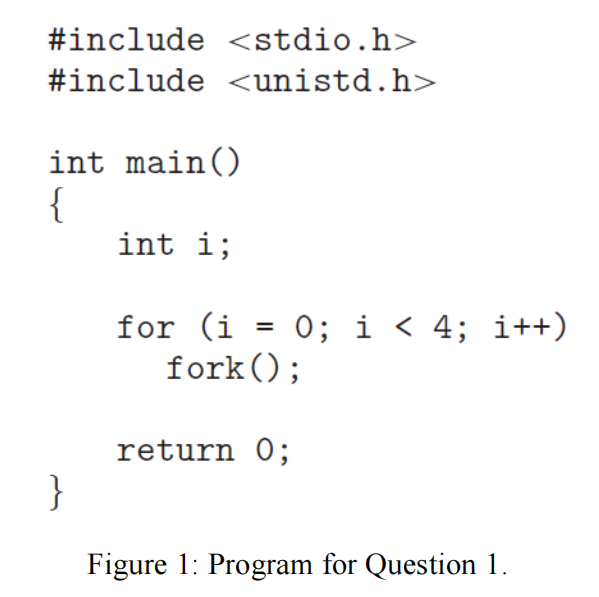
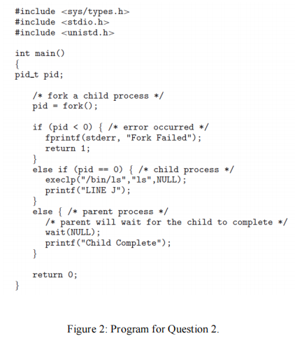
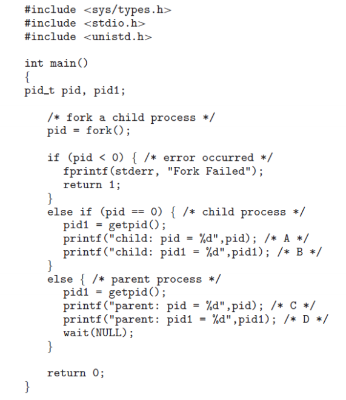
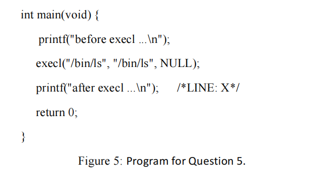
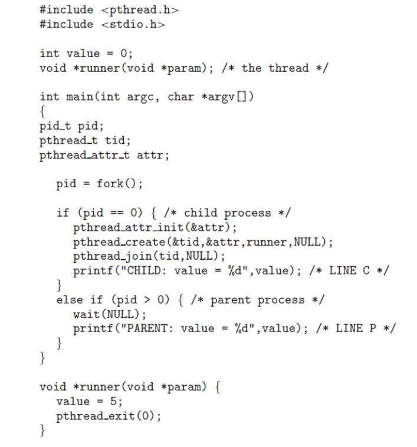

# 作业二

## 1. Including the initial parent process, how many processes are created by the program shown in Figure 1?

​		Initial Parents Process：1个进程

​		第一轮循环：1+1=2个进程（原有一个，创建一个）

​		第二轮循环：2+2=4个进程（原有的每个进程都会执行本轮循环并创建一个新进程）

​		第三轮循环：4+4=8个进程

​		第四轮循环：8+8=16个进程。

​		所以包括初始进程，一共会有16个进程。

## 2. Explain the circumstances under which the line of code marked printf(‘‘LINE J’’) in Figure 2 will be reached.

​		

​		execlp如果执行成功，直接结束进程，printf那一行将不会被运行。只有ls执行失败，printf("LINE J");才会被执行。正常情况下不会执行失败吧。

## 3. Using the program in Figure 3, identify the values of pid at lines A, B, C, and D. (Assume that the actual pids of the parent and child are 2600 and 2603, respectively.)

​	A. pid = 0

​	B. pid1 = 2603

​	C. pid = 2603

​	D. pid = 2600

## 4. Using the program shown in Figure 4, explain what the output will be at lines X and Y.

​	LINE X: CHILD: 0  CHILD: -1  CHILD: -4  CHILD: -9  CHILD: -16

​	LINE Y: PARENT: 0 PARENT: 1 PARENT: 2 PARENT: 3 PARENT: 4 

## 5. For the program in Figure 5, will LINE X be executed, and explain why.

LINE X不会被执行，因为execl执行成功以后会直接结束进程。

## 6. Explain why “terminated state” is necessary for processes

目的是为了使得其它进程可以获取其是否正常结束。进程可以正常终止也可以异常终止，这是其它进程可以通过获取状态来判断进程正常终止还是异常终止。

## 7. Explain what a zombie process is and when a zombie process will be eliminated (i.e., its PCB entry is removed from kernel).

僵尸进程：指进程已经终止，但其父进程并没有通过wait获取其终止状态。这个进程并没有做任何工作，却依然存在于内核中，所以叫僵尸进程。

如果始终没有进程去wait获取它的终止状态，init进程将会定期调用wait去回收僵尸进程。

## 8. Explain what data will be stored in user-space and kernel-space memory for a process.

进程在执行系统调用的时候，将触发中断并进入内核态。进程所执行的系统调用的相关数据存放在内核空间中，其它的数据则存放在用户空间中。

## 9. Explain the key differences between exec() system call and normal function call.

1. exec系统调用可以执行外部文件，普通函数调用只能执行程序内写好的函数。

2. 普通函数调用返回后会回到原来的函数继续执行。exec成功执行后会直接终止进程，不会回到原函数。

## 10. What are the benefits of multi-threading? Which of the following components of program state are shared across threads in a multithreaded process?a. Register values  b. Heap memory  c. Global variables  d. Stack memory

多线程的好处：

1. 线程可以直接共享较多的资源，而可以不使用通信手段，比多进程方便。
2. 不用为在创建线程时为每个线程独立分配内存地址空间，使得多线程比多进程资源开销小，创建的线程也可以更多。
3. 线程切换的开销比进程切换小。

线程间可以共享的内容：

​	b. Heap memory

​	c. Global variables

## 11. Consider the following code segment:

​	第一个fork: 创建一个进程，成为2个进程

​	第二个fork: 创建一个进程，成为3个进程

​	第三个fork: 每个进程都创建一个进程，即创建3个进程，成为6个进程。

所以总共创建了5个进程（不包括最开始的进程）

第二个进程会创建一个线程。第二个进程创建的第三个进程也会创建一个线程。一共创建了2个线程，如果算上5个新进程自带的线程，一共有7个新线程。

## 12. The program shown in the following figure uses Pthreads. What would be the output from the program at LINE C and LINE P?

​	LINE C: CHILD: value = 5

​	LINE P: PARENT: value = 0

## 13. What are the differences between ordinary pipe and named pipe?

普通管道（匿名管道）：

1. 只用于亲属关系的进程通信。
2. 只提供单向通信。
3. 进程结束，管道消失。

命名管道：

1. 存在于文件系统中对所有进程可见，提供任意两个进程通信。
2. 双向通信。
3. 除非手动删除管道，否则管道不会消失（即使使用它的进程都已经结束）