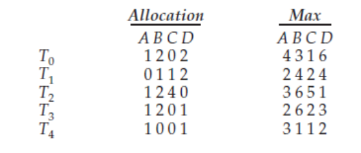
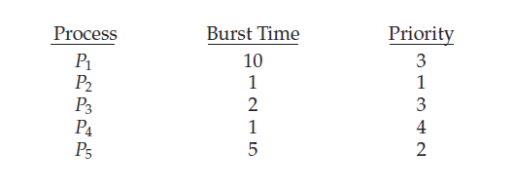
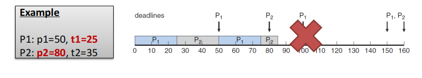

# 第三次作业

## List all the requirements of the entry and exit implementation when solving the critical-section problem. Analyze whether strict alternation satisfies all the requirements.

Requirements:

- Mutual Exclusion: No two processes could be simultaneously inside their critical sections.
- Each precess executing at a non-zero speed, but no assumptions should be made about the relative speed of the processes and the number of CPUs.
- Progress: No process running outside its critical section should block other processes.
- Bounded Waiting: No process would have to wait forever in order to enter its critical section.

Whether strict alternation satisfies all the requirments:

- Req 1: Obviously satisfies. 
- Req 2: Every process is running. If a process is not in the critical session, it runs busy-waitting. Satisfies.
- Req 3: Doesn't satisfy. Process 1 set round=2 out of critical section, but process 0 is blocked.
- Req 4: Satisfy. The alternation is so strict that every process will get into the critical section after a round.

## For Peterson’s solution, prove that it satisfies the three requirements of a solution for the critical section problem.

- Req 1: The process always let another process to enter the critical region first although she wants to enter too. So satisfies. 
- Req 2: Every process is running. If a process is not in the critical session, it runs busy-waitting. Satisfies.
- Req 3: Satisfied. Enter region and leave region give the opportunity to other process to enter critical session. (I'm a gentleman! )
- Req 4: Doesn't satisfy. One process may always let other process to get into the critical session if other process want to enter the critical session continuously. 

## What is deadlock? List the four requirements of deadlock.

Deadlock is a situation where a set of processes are blocked because each  process is holding a resource and waiting for another resource. 

Four requirements:

1. Mutual Exclusion: Only one process at a time can use a resource. 
2. Hold and wait:  A process must be holding at least one resource and waiting to acquire additional resources held by other processes. 
3. No preemption: A resource can be released only voluntarily by the process holding it after that process has completed its task. 
4. Circular wait: There exists a set $\{P_0 , P_1 , …, P_n\}$ of waiting processes such that $P_0$ waits for $P_1$ , $P_1$ waits for $P_2$ , …, $P_{n–1}$ waits for $P_n$ , Pn waits for $P_0$ 

## Consider the following snapshot of a system: Using the banker’s algorithm, determine whether or not each of the following states is unsafe. If the state is safe, illustrate the order in which the threads may complete. Otherwise, illustrate why the state is unsafe.



### a. Available = (2, 2, 2, 3)

Need Table is

|       | A    | B    | C    | D    |
| ----- | ---- | ---- | ---- | ---- |
| $T_0$ | 3    | 1    | 1    | 4    |
| $T_1$ | 2    | 3    | 1    | 2    |
| $T_2$ | 2    | 4    | 1    | 1    |
| $T_3$ | 1    | 4    | 2    | 2    |
| $T_4$ | 2    | 1    | 1    | 1    |

Select $T_4$, then available turns to (3, 2, 2, 4)

Select $T_0$, then available turns to (4, 4, 2, 6)

Select $T_1$, $T_2$, $T_3$

Safe. 

### b. Available = (4, 4, 1, 1)

Select $T_2$, then available turns to (5, 6, 5, 1)

Select $T_4$, then available turns to (6, 6, 5, 2)

Select $T_1$, then available turns to (6, 7, 6, 4)

Select $T_0$, $T_3$

Safe.

### c. Available = (3, 0, 1, 4)

Available B = 0, not safe.

### d. Available = (1, 5, 2, 2)

Select $T_3$, then available turns to (2, 7, 2, 3)

Select $T_2$, then available turns to (3, 9, 6, 3)

Select  $T_1$, $T_4$, $T_0$

Safe. 

## What is semaphore? Explain the functionalities of semaphore in process synchronization.

Semaphore is a variable or abstract data type used to control access to a common resource by multiple threads and avoid critical section problems in a concurrent system such as a multitasking operating system.

By executing P(semaphore) in entry section and V(semaphore) in exit section.

## Please use semaphore to provide a deadlock-free solution to address the dining philosopher problem.

Shared Object:

```c
#define N 5
#define LEFT ((i+N-1) % N)
#define RIGHT ((i+1) % N)
int state[N];
semaphore mutex = 1;	//To guarantee mutual exclusive access to the “state[N]” array.
semaphore s[N];		//Whether both chopsticks are available
```

Helper Function:

```c
void test(int i) {
	if(state[i] == HUNGRY && state[LEFT] != EATING && state[RIGHT] != EATING) {
		state[i] = EATING;	//Only if left and right are not eating, I could eat. Take the two chopsticks. 
		up(&s[i]);	//Both chopsticks are available for me. 
	}
}
```

Entry Section: 

```c
void take(int i) {
	down(&mutex);
	state[i] = HUNGRY;
	test(i);
	up(&mutex);
	down(&s[i]);	//If If both chopsticks are available, I eat. Else, I sleep.
}
```

Exit Section: 

```c
void put(int i) {
	down(&mutex);
	state[i] = THINKING;
	test(LEFT);		//Tell left: you could try to eat. 
	test(RIGHT);	//Tell right: you could try to eat. 
	up(&mutex);
}
```

## Consider the following set of processes, with the length of the CPU burst time given in milliseconds:	(The processes are assumed to have arrived in the order $P_1, P_2, P_3, P_4, P_5$, all at time 0.)



### Draw four Gantt charts that illustrate the execution of these processes using the following scheduling algorithms: FCFS, SJF (nonpreemptive), nonpreemptive priority (a smaller priority number implies a higher priority), and RR (quantum = 1).


### What is the turnaround time of each process for each of the scheduling algorithms in part a?

#### FCFS

- $P_1$: Turnaround time = 10
- $P_2$: Turnaround time = 1
- $P_3$: Turnaround time = 2
- $P_4$: Turnaround time = 1
- $P_5$: Turnaround time = 5

#### SJF Nonpreeption

- $P_1$: Turnaround time = 10
- $P_2$: Turnaround time = 1
- $P_3$: Turnaround time = 2
- $P_4$: Turnaround time = 1
- $P_5$: Turnaround time = 5

#### Nonpreemptive priority

- $P_1$: Turnaround time = 10
- $P_2$: Turnaround time = 1
- $P_3$: Turnaround time = 2
- $P_4$: Turnaround time = 1
- $P_5$: Turnaround time = 5

#### RR Q=1

- $P_1$: Turnaround time = 19
- $P_2$: Turnaround time = 1
- $P_3$: Turnaround time = 5
- $P_4$: Turnaround time = 1
- $P_5$: Turnaround time = 10

### What is the waiting time of each process for each of these scheduling algorithms?

#### FCFS

- $P_1$: Waiting time = 0
- $P_2$: Waiting time = 10
- $P_3$: Waiting time = 11
- $P_4$: Waiting  time = 13
- $P_5$: Waiting time = 14

#### SJF Nonpreeption

- $P_1$: Waiting time = 9
- $P_2$: Waiting time = 0
- $P_3$: Waiting time = 2
- $P_4$: Waiting time = 1
- $P_5$: Waiting time = 4

#### Nonpreemptive priority

- $P_1$: Waiting time = 6
- $P_2$: Waiting time = 0
- $P_3$: Waiting time = 16
- $P_4$: Waiting time = 18
- $P_5$: Waiting time = 1

#### RR Q=1

- $P_1$: Waiting  time = 9
- $P_2$: Waiting time = 1
- $P_3$: Waiting time = 5
- $P_4$: Waiting  time = 3
- $P_5$: Waiting time = 9

### Which of the algorithms results in the minimum average waiting time (over all processes)?

SJF. 

### Illustrate the pros and cons of the algorithms: FCFS, SJF, priority scheduling and RR.

- FCFS: Simple to implement, but may have long waiting time and turnaround time. (Depending on the arrival time)
- SJF is provably optimal in that it gives the minimum average waiting time. But don't care about priority.
- Priority Scheduling: Care about priority, but may cause longer waiting time and turnaround time. 
- RR: May cause long waiting time and turnaround time, but The responsiveness of the processes is great under the RR algorithm. E.g., you won’t feel a job is “frozen” because every job is on the CPU from time to time!

## Illustarte the key ideas of rate-monotonic scheduling and earliestdeadline-first scheduling. Give an example to illustrate under what circumstances rate-monotonic scheduling is inferior to earliest-deadline-first scheduling in meeting the deadlines associated with processes? 

- Rate-monotonic scheduling: Each process is assigned a priority proportional to its rate, and schedule processes with a static priority policy with preemption (fixed priority)
- earlistddl-first: Dynamically assigns priorities according to deadline (the earlier the deadline, the higher the priority)

This circumstances that rate-monotonic scheduling is inferior to earliest-deadline-first scheduling.

