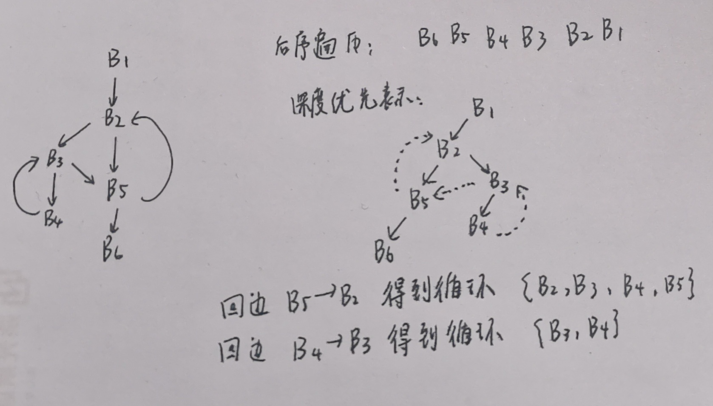

# 第十次作业

## 9.1

### (a)

​		如图所示

## 9.3

### (c)

def: 被赋值且在当前块中，赋值语句之前没有被引用

use: 被调用，且在当前块中调用之前没有被赋值

数据从后往前流动，即后面告知前面哪些变量活跃

| BasicBlock | use     | def    | IN            | OUT           |
| ---------- | ------- | ------ | ------------- | ------------- |
| $B_1$      | $\phi$  | a, b   | e             | a, b, e       |
| $B_2$      | a, b    | c, d   | a, b, e       | a, b, c, d, e |
| $B_3$      | b, d    | $\phi$ | a, b, c, d, e | a, b, c, d, e |
| $B_4$      | a, b, e | d      | a, b, c, e    | a, b, c, d, e |
| $B_5$      | a, b, c | e      | a, b, c, d    | a, b, d, e    |
| $B_6$      | b, d    | a      | b, d          | $\phi$        |

## 9.16

### (a)

| 支配结点 |            支配对象            |
| :------: | :----------------------------: |
|  $B_1$   | $B_1、B_2、B_3、B_4、B_5、B_6$ |
|  $B_2$   |   $B_2、B_3、B_4、B_5、B_6$    |
|  $B_3$   |      $B_3、B_4、B_5、B_6$      |
|  $B_4$   |        $B_4、B_5、B_6$         |
|  $B_5$   |             $B_5$              |
|  $B_6$   |             $B_6$              |

### (b)

后序遍历: $B_6,B_5,B_4,B_3,B_2,B_1$​​

深度优先排序: $B_1,B_2,B_3,B_4,B_5,B_6$​​​

### (c)

前进边：$B_1\rightarrow B_2,B_2\rightarrow B_3,B_3\rightarrow B_4,B_4\rightarrow B_5,B_4\rightarrow B_6$​​​

后撤边：$B_2\rightarrow B_2,B_3\rightarrow B_3,B_5\rightarrow B_2$​​​

交叉边：无

### (d)

是可归约的

后撤边都满足支配关系，所以后撤边都是回边

### (e)

深度为1

### (f)

回边$B_2\rightarrow B_2$对应循环$\{B_2\}$

回边$B_3\rightarrow B_3$​对应循环$\{B_3\}$

回边$B_5\rightarrow B_2$​均对应循环$\{B_2,B_3,B_4,B_5\}$
