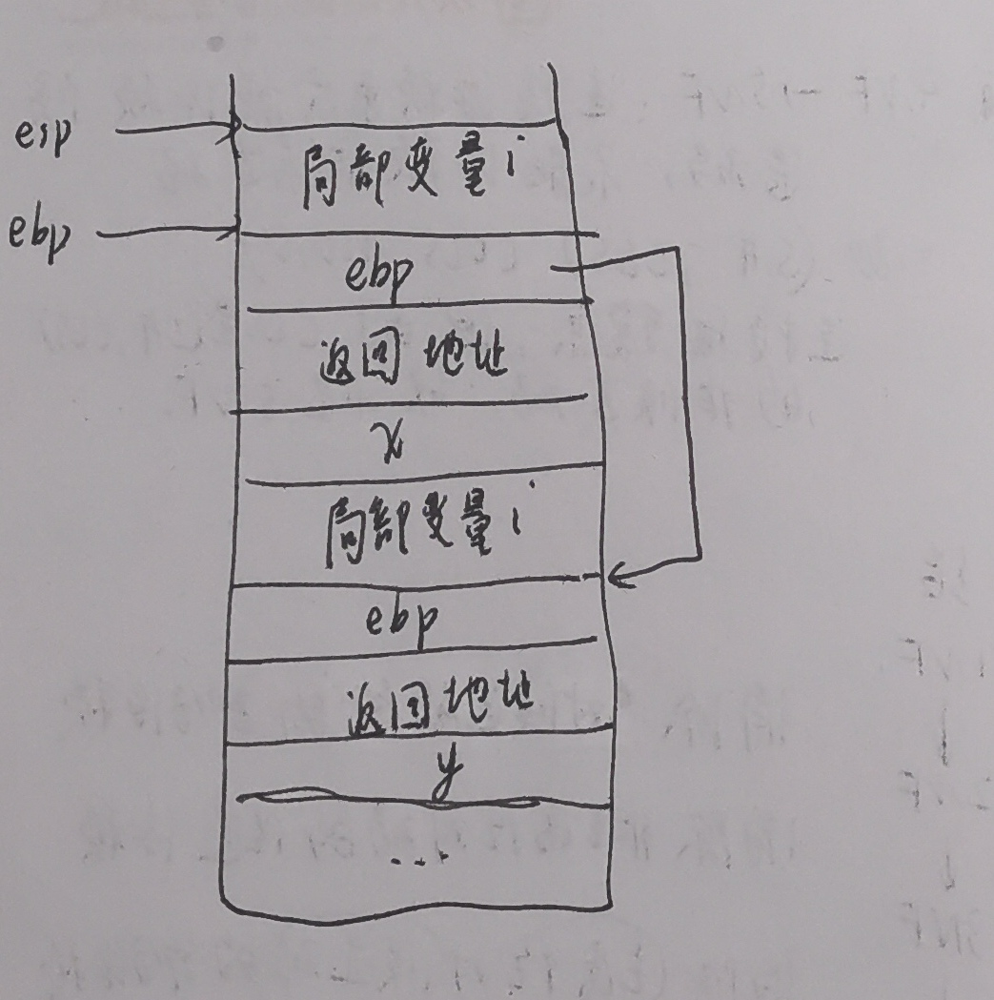

# 第十次作业

## 6.2

`head.h`中包含

```c
short int a = 10;
```

头文件包含定义，如果头文件在一个工程中被引用两次，相当于定义了两次变量。

建议改成

```c
extern short int a
```

## 6.5

答：考虑在数组中连续分配地址的情况。

​	如果b的空间是10， 则long对齐8字节，short对齐两字节。再申请下一个空间的时候，long就不再从8字节开始对齐了。

所以直接申请16各字节，空6个字节，long永远从8字节整数倍对齐。

## 6.6

如图


