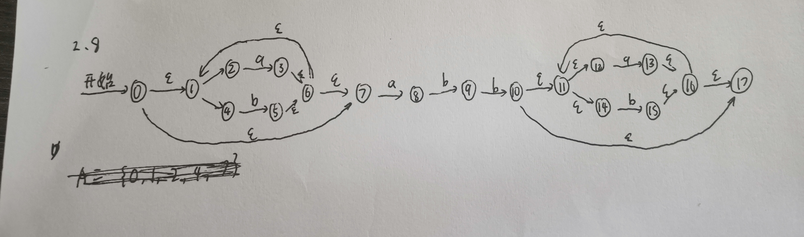
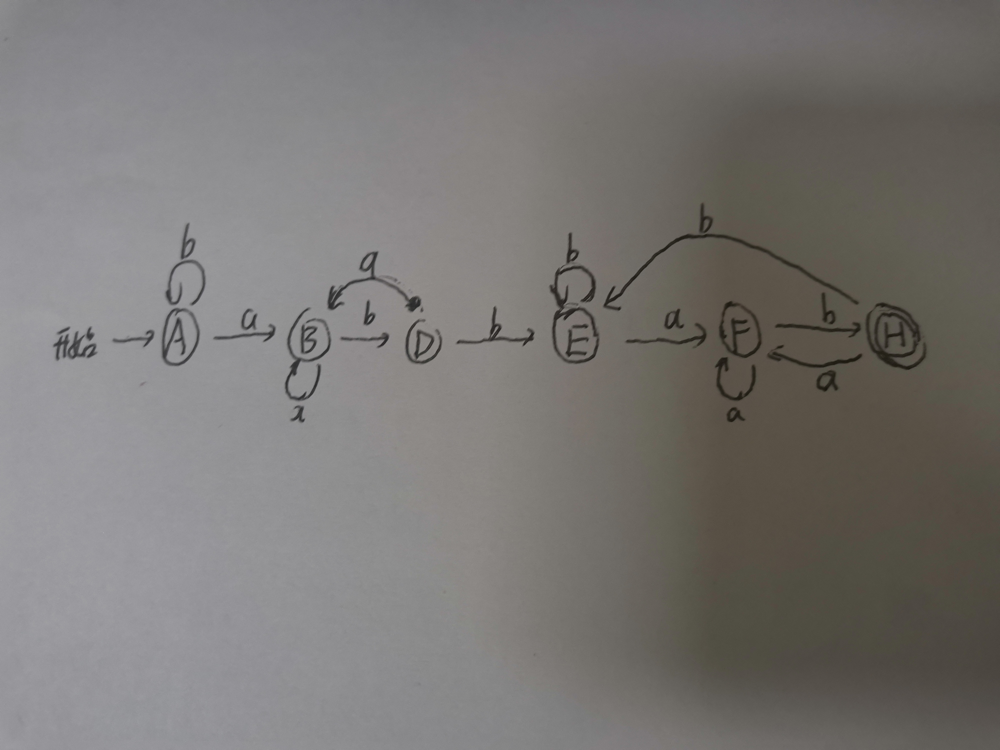
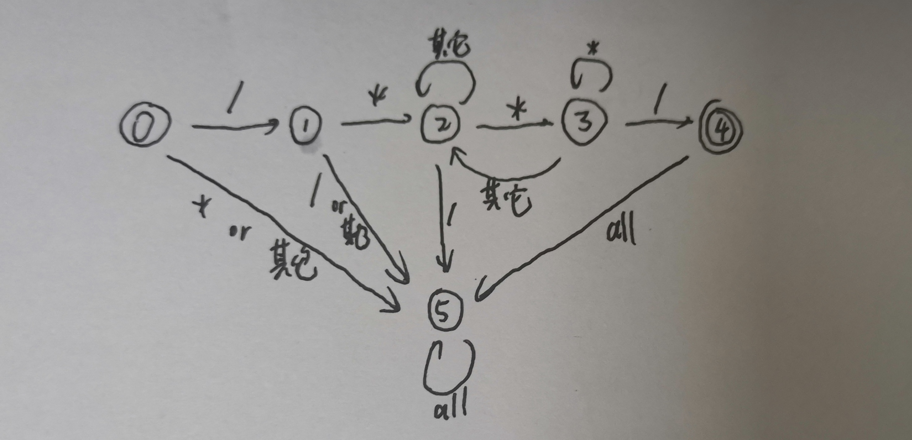
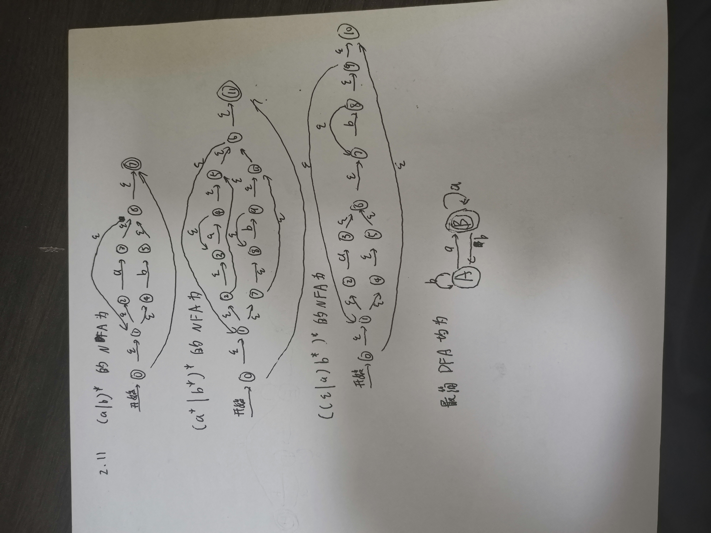

# 第一次作业

薛佳龙 PB19061212 

## 2.8

#### NFA

#### 状态集

A={0，1，2，3，4，7}

B={1，2，3，4，6，7，8}

C={1，2，4，5，6，7}

D={1，2，4，5，6，7，9}

E={1，2，4，5，6，7，10，11，12，14，17}

F={1,2,3,4,6,7,8,11,12,13,14,16,17}

G={1,2,4,5,6,7,11,12,14,15,16,17}

H={1,2,4,5,6,7,9,11,12,14,15,16,17}

I={1,2,4,5,6,7,10,11,12,14,15,16,17}

#### 状态转换表

| 状态集 | a    | b    |
| ------ | ---- | ---- |
| A      | B    | C    |
| B      | B    | D    |
| C      | B    | C    |
| D      | B    | E    |
| E      | F    | G    |
| F      | F    | H    |
| G      | F    | G    |
| H      | F    | I    |
| I      | F    | G    |

A,C状态无法区分

E,G,I状态无法区分

#### DFA

## 2.10

4为终结  5为错误

## 2.11

## 3.1

