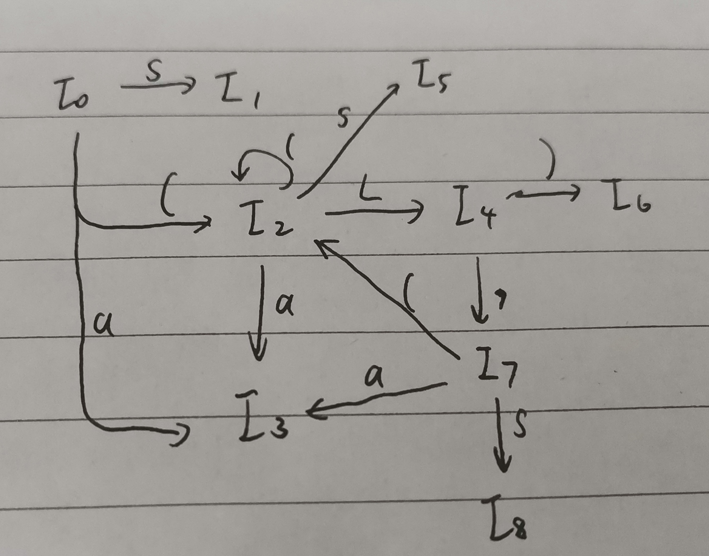

# 第四次作业

## 3.17

### 拓广文法

$S'\rightarrow S\ \ \ \ S\rightarrow (L)|a\ \ \ \ L\rightarrow L,S|S$

### 构造项目集规范族

$I_0=\{S'\rightarrow\cdot S,S\rightarrow\cdot(L),S\rightarrow\cdot a\}$

$goto(I_0, S)$

$I_1=\{S'\rightarrow S\cdot\}$

$goto(I_0,()$

$I_2=\{S\rightarrow(\cdot L),L\rightarrow \cdot L,S,L\rightarrow \cdot S,S\rightarrow\cdot (L),S\rightarrow\cdot a\}$

$goto(I_0, a)$

$I_3=S\rightarrow a\cdot$

$goto(I_2,L)$

$I_4=\{S\rightarrow(L\cdot),L\rightarrow L\cdot ,S\}$

$goto(I_2,()$

计算结果还是$I_2$

$goto(I_2,S)$

$I_5=\{L\rightarrow S\cdot\}$

$goto(I_4,))$

$I_6=\{S\rightarrow (L)\cdot\}$

$goto(I_4,,)$

$I_7=\{L\rightarrow L,\cdot S,S\rightarrow\cdot(L),S\rightarrow\cdot a\}$

$goto(I_4,S)$

$I_8=\{L\rightarrow L,S\cdot\}$

$goto(I_7,()$

结果还是$I_2$​

$goto(I_7,a)$

结果还是$I_3$

### DFA

## 3.21(a)

### 1

对于第一个产生式的两个候选式

$FIRST(AaAb)\cap FIRST(BbBa)=\{a\}\cap \{b\}=\phi$

所以为$LL(1)$​​文法。

### 2

按$A\rightarrow\epsilon$和$B\rightarrow\epsilon$进行规约时，有

$FOLLOW(A)=\{a,b\}$

$FOLLOW(B)=\{b,a\}$

$FOLLOW(A)\cap FOLLOW(B)=\{b,a\}\neq \phi$

会出现归约-归约冲突，因此不是SLR(1)文法。

## 3.22

### 1

考虑移进d

$A\rightarrow d\cdot$

$S\rightarrow d\cdot c$

$S\rightarrow bd\cdot a$

而$FOLLOW(A)=\{a,c\}$

$\{a,c\}\cap\{c\}\cap\{a\}\neq \phi$

存在归约-移进冲突，所以不是SLR(1)文法

### 2

文法可能的句子只有：da,bdc,dc,bda

当栈顶为d时，栈外为c才可以归约

当栈顶为bd时，栈外为a才可以归约

冲突解决

所以文法为LR(1)文法。该文法中没有同心集，所以也是LALR(1)文法。

## 3.27

### 1

S：浮点数或整数

I：整数

R：浮点数

W：浮点数的整数部分

F：浮点数的小数部分

### 2

不是LR(1)文法。第一次移进d时，如果下一个不是p，则不知道该归约为I还是归约为W还是归约为F，且冲突无法解决。
