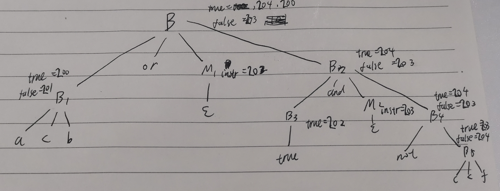

# 第六次作业

## 7.1

### b

见图片


### d

$t_1=a+b$

$t_2=c+d$

$t_3=t_1*t_2$

$t_4=-t_3$

$t_5=t_1+c$

$t_6=t_4+t_5$

## 7.8

语法制导定义表格第五条改为

| $B\rightarrow E_1\text{ relop }E_2$ | $B.code=E_1.code||E_2.code||gen('if',E_!.place,relop.deop,E_2.place,'goto',B.false)$ |
| ----------------------------------- | ------------------------------------------------------------ |

其中deop定义为

| op   | deop |
| ---- | ---- |
| >    | <=   |
| <    | >=   |
| >=   | <    |
| <=   | >    |
| ==   | !=   |
| !=   | ==   |

## slide8ppt70页

### 三地址代码

```assembly
(200) if a<b goto 
(201) goto 202
(202) goto 203
(203) if c<f goto 
(204) goto 
```

### 注释分析树

见图片



### 回填细节

在归约$B_2\rightarrow B_3\text{ and }M_2B_4$时，用203回填202的不完整goto指令

在归约$B\rightarrow B_1\text{ or }M_1B_2$​时，用202回填201的不完整goto指令

