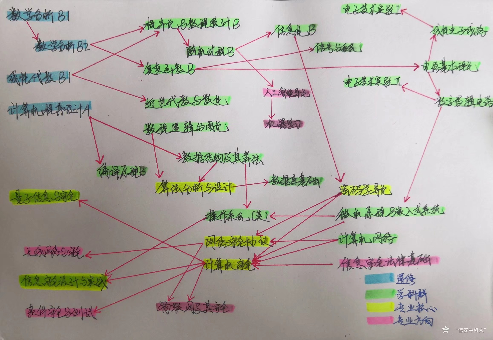

# USTC网安大礼包食用方法
首先, 感谢nico电子资料共享群, 妮可网安闲聊群, 三三的女装更衣室 ( x ) 三个群聊的朋友们 ! ! !

## 重要提醒
本资料全部来源于网络以及课程群. 对于部分不在本仓库的资料, 是为了防止不必要的纠纷, 根据学校学院和系里规定, 不得提供或传播给非中国科学技术大学的单位或个人. 对此也请外校同学谅解. 对于作业内容, 请不要直接抄袭. 所提供资料仅供预习和复习参考

## 课程介绍

首先给出课程框架

然后往死里卷就完事了 ( 狗头 ) 

### 注意

-   教材与参考书等内容以书名, 出版社, 作者为准
    -   需要留意, 有些参考书是多册书籍
    -   作者标注优先级以 " 封皮第一位作者, 主编, 责任编辑 " 排序, 且仅标注一位作者
-   通修课和学科群基础课的老师较多, 选课也是一门学问, 且严重影响期末分数
-   专业核心课和专业方向课主要在大三大四分专业之后, 可选范围较少
-   该开源项目适用于中国科学技术大学2018级及以后的培养方案
    -   2019年，信息安全系改为网络空间安全学院
    -   部分修改课程, 如王小谟英才班以及其他年级修订后的增改内容会在最后补充
    -   该补充是以上一个二级标题为对比进行
    -   由于培养方案教务系统已有, 在此并不对属性修改 ( 如必修改成选修 ) 以及删除的课程进行说明
    -   修改的课程如有和以前课程类似内容, 将注明以下几点
        -   等效课程, 即只是换了个课程名字 ( 因为2020级之后教务处重新规范了课程编号 )
        -   相似课程, 内容相近但教学侧重点等不同
        -   低级课程, 内容相近但难度较低
        -   高级课程, 内容相近但难度较高

## 通修课介绍

### 数学分析B1

-   教材: 因老师而异
-   参考书: 微积分学导论 ( 上册 ) , 中国科学技术大学出版社, 侯建国
    -   部分教学班把它作为教材
    -   是曾经的单变量微积分教材
-   参考书: 微积分学习指导 ( 上册 ) , 中国科学技术大学出版社, 段雅丽
    -   适合中等及以下水平的同学
    -   不需要全会做, 但是每个题型都要涉猎一点
-   参考书: 吉米多维奇数学分析习题集题解 ( 全六册 ) , 山东科学技术出版社, 费定晖
    -   适合喜欢钻研的同学以及中上水平的同学
    -   难度几乎对标数学系, 但是题量巨大
    -   章节设置和科大教学进度不符, 建议针对性刷题
-   参考书: 数学分析教程 ( 上册 ) , 中国科学技术大学出版社, 常庚哲
    -   中科大数学系的标配书籍
    -   对非数学系的同学可以作为一个参考
-   教学内容: 一元函数极限, 求导, 不定积分, 定积分, 微分方程
-   这门课在19级及以前, 对英才班是数学分析B1, 对普通班是单变量微积分, 对基础班是基础微积分I. 根据入学考试数学和物理成绩进行分级分班教学
-   在19级之后, 单变量微积分取消, 全校同修数学分析B1, 但保留基础微积分I
-   课程难度对大一新生是很困难的, 需要多刷题
-   多记一些特殊的例子,  有助于判断题和证明题运用

### 数学分析B2

-   教材: 因老师而异
-   参考书: 微积分学导论 ( 下册 ) , 中国科学技术大学出版社, 侯建国
    -   部分教学班把它作为教材
    -   是曾经的多变量微积分教材
-   参考书: 微积分学习指导 ( 下册 ) , 中国科学技术大学出版社, 段雅丽
    -   适合中等及以下水平的同学
    -   不需要全会做, 但是每个题型都要涉猎一点
-   参考书: 吉米多维奇数学分析习题集题解 ( 全六册 ) , 山东科学技术出版社, 费定晖
    -   适合喜欢钻研的同学以及中上水平的同学
    -   难度几乎对标数学系, 但是题量巨大
    -   章节设置和科大教学进度不符, 建议针对性刷题
-   参考书: 数学分析教程 (下册 ) , 中国科学技术大学出版社, 常庚哲
    -   中科大数学系的标配书籍
    -   对非数学系的同学可以作为一个参考
-   教学内容: 多元函数偏导, 积分, 场论, 无穷级数, 参变量积分, Fourier变换
-   这门课在19级及以前, 对英才班是数学分析B2, 对普通班是多变量微积分, 对基础班是基础微积分II. 根据入学考试数学和物理成绩进行分级分班教学
-   基础班还需要在暑假小学期补充一门课基础微积分III
-   在19级之后, 多变量微积分取消, 全校同修数学分析B2, 但保留基础微积分II和基础微积分III
-   课程难度相对单变量微积分少了好多奇奇怪怪的证明题, 掌握计算技巧不难拿高分

### 线性代数B1

-   教材: 线性代数与解析几何 ( 第2版 ) , 高等教育出版社, 陈发来
-   参考书: 线性代数与解析几何学习指辅导 中国科学技术大学出版社, 申伊塃
    -   内容多且繁杂, 有很多内容对标了数学系的线性代数要求
    -   建议根据老师讲课内容选择性学习
-   教学内容: 矩阵, 行列式, 线性空间, 实二次型
-   这门课本身难度较大, 但考试难度适中, 掌握老师讲课的题型即可. 不过对新生, 可能短时间无法很好接受这门课的内在思想

### 计算机程序设计A

-   教材: 计算机程序设计 ( C语言版 ) , 机械工业出版社, 贾伯琪
-   参考书: 计算机程序设计学习指导与实践, 中国科学技术大学出版社, 贾伯琪
    -   上机实验在这本书上
    -   此书和教材的主要内容大致相同
-   教学内容: 程序设计思想, 基础的一些微机原理与计算机体系结构知识, C语言数据类型, 运算符, 函数, 指针, 文件的操作, 位运算
-   实验内容: 参考书的课后习题, 较简单
-   额外注意, 这门课讲的内容主要是C语言的语法, 不是C语言的运用
    -   会读代码和会写代码是不一样的
    -   比如你可以不知道int *a[10]和(int *)a[10]的区别仍然能写出符合题意的代码, 但考试读代码内容要是考这个知识点, 你会答不上得不到分的
    -   类似的还有i++ + ++i等问题

## 学科群基础课介绍

### 概率论与数理统计B

-   教材: 概率论与数理统计, 中国科学技术大学出版社, 陈希孺
-   参考书: 概率论与数理统计习题全解指南浙大第4版, 高等教育出版社, 盛骤
    -   这是一本习题集, 和考试内容接近
-   教学内容: 常见概率分布, 随机变量的数字特征, 参数估计, 假设检验, 回归分析
-   跟住课堂就行, 注意课程的后半部分较难

### 随机过程B

-   教材: 随机过程 ( 第3版 ) , 科学出版社, 方兆本
-   教学内容: Poisson过程, Markov过程, 平稳过程, 功率谱密度等
-   随机过程随即过, 不是白叫的
-   学懂了就很简单, 学不懂就很难 ( 好像是废话 )

### 信息论B

-   教材: 信息论基础 ( 原书第2版 ) , 机械工业出版社, Thomas M. Cover
-   教学内容: 离散随机变量的信息熵的相关公式, 渐进均分性AEP理论, 随机过程的熵率, 数据压缩与编码, 信道容量, 然后类比到连续随机变量, 率失真理论
-   建议多记结论和公式
-   对概统要求很高, 给分比较玄学
-   往年考试题很有参考价值, 在大礼包里有

### 复变函数B

-   教材: 数学物理方法, 中国科学技术大学出版社, 严镇军
-   教学内容: 把实变数函数推广到复变数函数, 推广到相关的解析函数的积分, 级数表示等, 然后是留数定理和它的应用, 最后讲述Laplace变换
-   考试计算量相当大, 做好心理准备, 答不完问题也不大
-   建议平时多练, 课后习题做一做
-   建议校内同学参看杨光灿烂学长的学习资料, QQ群1046339474

### 信号与系统

-   教材: 信号与系统理论方法和应用, 中国科学技术大学出版社, 郭武
-   教学内容: 信号和系统两个概念的数学描述, 信号的运算和变换, 一些常见的基本信号, 线性时不变系统, 卷积,微分方程和差分方程的系统, 变换域表示法, 连续和离散Fourier级数, 连续和离散Fourier变换, 连续的Laplace变换, 离散的Z变换, 系统的变换域分析
-   建议多背记各种特殊函数以及对应的变换
-   建议熟练掌握卷积的各种运算技巧

### 电路基本理论

-   教材: 电路理论基础, 高等教育出版社, 陈希有
-   参考书: 电路基础 ( 第3版 ) 教学指导书, 西安电子科技大学出版社, 王松林
    -   一本难度适中的习题集, 和考试内容相近
-   教学内容: 基尔霍夫定律, 线性直流电路, 电路相关定理, 电容与电感, 正弦电路, 频率特性与谐振, 线性动态电路的时域分析与频域分析, 二端口网络
-   记笔记! 往年题!
-   前面各种分析电路的方法是基础
-   Laplace变换求解很重要

### 线性电子线路

-   教材: 线性电子线路 ( 第2版 ) , 清华大学出版社, 戴蓓蒨
-   教学内容: 线性系统复频域分析方法, Bode图, PN结特性, BJT和MOS管的相关放大电路特性, 集成运放, 反馈电路, 模拟电子的应用电路
-   书很厚, 不全讲
-   考试不考和微观粒子有关的内容
-   建议熟练掌握BJT管和FET管的放大电路性质以及运算放大器的相关公式

### 电子技术实验I

-   实验内容: 电路基本定律的研究, 一阶电路的研究, 晶体管单管放大器, 差动放大器, 运放的模拟运算, 负反馈放大器
-   线性电子线路的实验课, 在电四楼
-   期末考试是自己进行实验, 注意时间安排
-   考虑优秀率限制, 但是给分不错, 不会太为难学生

### 数字逻辑电路

-   教材: 数字电子技术基础 ( 第6版 ) , 高等教育出版社, 阎石
-   参考书: 数字电子技术基础 ( 第6版 ) 学习辅导与习题解答, 高等教育出版社, 阎石
    -   类似于补充习题集, 也是教材课后习题的答案, 作业可以参考一下
-   教学内容: 数制和码制以及相关运算和转换, Bool代数基础, 门电路, 组合逻辑电路, 锁存器电路, 时序逻辑电路, Schmidt触发器电路, 单稳态电路, 多谐振荡电路, 555定时器电路, AD/DA转换电路
-   建议校内同学参看高源学长的学习资料, QQ群550220728

### 电子技术实验II

-   实验内容: 门电路, 加法器与数据选择器, 编码器与译码器, 移位寄存器, 抢答器的设计与实现, 555时基电路的探究, 数字钟的设计与实现
-   数字逻辑电路的实验课, 在电四楼
-   期末考试是自己进行实验, 注意时间安排
-   考虑优秀率限制, 但是给分不错, 不会太为难学生

### 微机原理与嵌入式系统

-   教材: 自编讲义
-   教学内容: 计算机组成原理概述, 处理器的工作原理, 存储器系统, 总线与接口, ARM处理器体系结构与编程模型, ARM指令系统与汇编语言, ARM程序开发设计
-   实验内容: LED流水灯, 利用GPIO的DIP控制开关灯与LCD控制字符显示, 利用TIM的LED闪烁与呼吸灯, 利用EXTI的SW与DIP控制灯亮暗, 利用UART的串口通信, C语言与汇编语言的混合编程, 另外有一个需要写报告的综合实验
-   实验是基于STM32F407ZG的开发板进行的实验, 使用Keil开发平台的
-   课上的内容多, 杂, 难记忆, 需要平时常复习
-   不过别担心, 老师期末会给一个提纲, 几乎都在提纲范围考察

### 操作系统 ( 英 )

-   教材: 操作系统精髓与设计原理 ( 第8版 ) , 电子工业出版社, William Stallings
-   教学内容: 计算机组成原理, 部分在微机原理与嵌入式系统里没有涉及的微机原理知识, 进程, 内存管理, 处理器调度, 文件系统, 嵌入式系统操作
-   实验内容: 对标清华大学的MOOCOS实验, 百度有很多参考内容, 相当于自己做了一个小操作系统
-   开学第一个月要求看完整本书, 十一假期回来小测, 但是难度比较基础
-   授课是汉语, PPT汉英混编, 作业考试题是英语
-   有一个大作业, 类似于科研项目, 可以报名, 期末直接记4.3

### 近世代数与数论

-   教材: 数论讲义 ( 上册 ) , 高等教育出版社, 柯召
-   教材: 应用近世代数 ( 第3版 ) , 清华大学出版社, 胡冠章
-   教学内容: 整除性与素性等相关概念, 最大公因数最小公倍数等定义, 一次不定方程, 同余相关概念, 孙子定理与应用, 二次剩余, Legendre符号, Jacobi符号, Gauss引理, 次数, 原根, 指数, 群, 环, 域的相关概念
-   先讲数论, 后讲近世代数
-   数论相对简单, 近世代数十分抽象难懂, 但是考试相对简单一点
-   学习近世代数的时候, 可以用数论类比, 便于具体化近世代数的抽象概念, 加深记忆数论的一些深层次逻辑
-   可以认为数论是近世代数的一个实例

### 数理逻辑与图论

-   教材: 离散数学及其应用, 机械工业出版社, Kenneth H. Rosen
-   建议图论部分多积累证明方法
-   期末考试难度较大, 给分比较玄学
-   建议随堂听课, 听课很重要

### 数据结构及其算法

-   教材: 因老师而异
-   参考书: 数据结构及应用算法, 中国科学技术大学出版社, 袁平波
    -   部分教学班把它作为教材
-   参考书: 数据结构C语言版第2版, 人民邮电出版社, 严蔚敏
    -   部分教学班把它作为教材
-   教学内容: 线性表, 栈, 队列, 串, 数组, 树, 二叉树, 图, 查找, 排序
-   实验内容: 因老师而异
    -   有些同学觉得太容易, 有些同学觉得太难
    -   上机实验可以参看评课社区[USTC评课社区](https://icourse.club/search/?q=%E6%95%B0%E6%8D%AE%E7%BB%93%E6%9E%84%E5%8F%8A%E5%85%B6%E7%AE%97%E6%B3%95)
-   建议多敲代码, 熟练掌握库函数及其应用

### 数据库基础

-   教材: 自编讲义
-   教学内容: 数据库模型与理论知识, SQL语言, 数据库设计理论, 数据库的保护, 数据库的设计方法
-   实验内容: 
    -   前四个是小实验, 后面有个大作业需要设计GUI
    -   建议同学们在老师讲课的时候录课, 以便赶DDL的时候学习
    -   千万别拖DDL, 会很惨
    -   对于大作业, 建议学一学Pascal和Delphi
-   往年考试题没有, 但是有个题库不错, 大概率和考试题重合

### 编译原理B

-   教材: 编译原理 ( 第3版 ) , 高等教育出版社, 陈意云
-   参考书: 编译原理 ( 第3版 ) 习题精选与解析, 高等教育出版社, 陈意云
    -   是一本习题集, 但是与教学内容稍有偏差
    -   不过作为作业的参考答案还是不错的
-   参考书: 编译原理实验教程, 高等教育出版社, 张昱
    -   实验的相关参考书
    -   但是对我们的实验没啥价值, 不过如果看了还是很有收获的
-   教学内容: 词法分析, 语法分析, 语法制导的翻译, 类型检查, 运行时的内存管理, 中间代码生成, 代码生成, 优化代码, 编译系统和运行系统
-   实验内容: 基于代码模板写一个C语言的解释器
    -   17级, 18级实验平台在[educoder](https://www.educoder.net/classrooms/3202)上面, 有基础的同学可以提前试一试
    -   实现相关功能可以通过测点即可
-   词法分析, 语法分析, 语法制导的翻译这前半部分很重要, 很抽象, 很难懂
    -   但是不要钻牛角尖, 就像线性代数的美妙绝不是各种特殊的行列式计算一样, 编译原理的美妙在于算法, 而不是各种奇奇怪怪的产生式的写法
    -   产生式只是工具, 知道怎么用, 会写简单的就可以
-   后半部分需要背记的多, 难度较低
-   考试较难, 但调分很给力

### 计算机网络

-   教材: 计算机网络 ( 第5版 ) , 清华大学出版社, Andrew S. Tenenbaum
    -   这本书很厚, 当然不会全讲
-   教学内容: 计算机网络概要, 物理层, 数据链路层, IP层, 传输层, 应用层
-   实验内容: 网络的使用与配置, IP组网, TCP/UDP通信程序设计, RDT通信
    -   实验本身很难
    -   但是网上参考资料较多
-   核心在于数据链路层, IP层, 传输层
-   有小测, 随机点名
-   需要多记很多概念以及英文缩写的全名, 建议平时认真学

## 专业核心课介绍

### 密码学导论

-   教材: 自编讲义
-   教学内容: 古典密码学, 现代密码学理论, Feistel结构分组密码, 有限域的分组密码, 分组密码的使用, 序列密码, 公钥密码数学基础, 公钥密码, 消息认证, 数字签名, 身份认证, 部分密码协议, 数字媒体安全
-   实验内容: 因学期年级而异
    -   实验本身较简单, 可以用各种语言
    -   实验报告要求毕业论文格式, 具体可参考[毕业论文格式](https://www.teach.ustc.edu.cn/notice/notice-teaching/11530.html/attachment/%E6%9C%AC%E7%A7%91%E6%AF%95%E4%B8%9A%E8%AE%BA%E6%96%87%EF%BC%88%E8%AE%BE%E8%AE%A1%EF%BC%89%E5%BC%8F%E6%A0%B7)进行写作
-   课程知识点琐碎, 部分题型脑洞较大, 需要加深记忆
-   作业认真做真的真的很有用
-   考试题型比较基础, 老师会提供往年题目, 参考价值巨大
-   调分很给力

### 算法分析与设计

-   教材: 算法导论 ( 原书第3版 ) , 机械工业出版社, Thomas H. Cormen
-   教学内容: 算法入门, 函数增长, 递归分析, 分治策略, 概率分析, 随机算法, 排序, 顺序统计学, 树搜索, 动态规划, 贪心算法, 回溯法, 分支限界法, 随机算法应用
-   实验内容: 因学期年级而异
    -   总体较难, 需要很强的编程能力

-   建议多刷刷[Leetcode](https://leetcode-cn.com/)
-   动态规划及其之后是核心, 难度陡增

### 网络安全协议

-   教材: 网络安全基础应用与标准 ( 第5版 ) , 清华大学出版社, William Stallings
-   教学内容: 网络安全综述, 公钥基础设施, IPSec的AH/ESP/IKE协议, SSL/TLS协议, 防火墙与NAT虚拟专用网, 应用层安全协议, 无线网安全
-   实验内容: 文献调研, IETF工作调研, Linux防火墙配置与地址转换, OpenSSL系统分析和应用, GnuPG原理和使用, IPSec虚拟专用网搭建, FreeRadius搭建和使用, Linux下常见服务器搭建, PKI/CA体系和EJBCA的搭建
    -   这些内容做一个就行
    -   也可以自选题, 需要老师助教核定
-   有小测, 随机点名
-   需要多记很多概念以及英文缩写的全名, 建议平时认真学

### 计算机安全

-   教材: 计算机安全学原书第2版, 机械工业出版社, Dieter Gollmann
-   教学内容: 计算机安全基础与相关概念, 操作系统安全, 应用系统安全, 云计算安全, 网络系统安全
    -   内容繁杂, 老师考前会讲什么考什么不考
-   有点名, 但来的人还是很少
-   作业和考试题比较接近, 有很大参考价值

### 量子信息与安全

-   教材: 自编讲义
-   教学内容: 量子信息理论知识线性代数, 量子密码基础, 量子密码的安全性, 量子纠缠, 量子信息安全和其他协议, 量子计算
-   没有考试没有点名
-   考核来自于两次大作业
    -   一个是仿真BB84密钥的实验, matlab有手就行
    -   一个是调研和量子通信/量子安全有关的报告, 论文格式

### 信息安全设计与实践

-   教学内容: CTF, 密码学, 软件Reverse, web安全, 二进制, 杂项
-   作业是三部分, 线上实验60, 大作业图片隐写20, 大作业代码插桩20
-   任务量特别重, 大多数同学反映如果认真做是做不完的
-   自行权衡

## 专业方向课介绍

### 人工智能导论

-   教材: 人工智能导论模型与算法, 高等教育出版社, 吴飞
-   参考书: 机器学习, 清华大学出版社, 周志华
    -   很有名的一本书, 绰号"西瓜书"
-   参考书: 神经网络与深度学习, 机械工业出版社, 邱锡鹏

-   教学内容: 搜索, 知识的表示方式, 确定性逻辑推理, 非精确性概率推理, 统计学习方法, 深度学习, 强化学习与博弈
-   实验内容: 黑白棋AI算法, 逻辑推理实验, 线性回归模型, 人脸识别, 深度学习, 强化学习, 对抗样本
    -   教材后面的七个实验做三个
    -   实验一和五必做

### 机器学习

### 信息安全法律基础

-   二等级课, 上八次, 点名三次, 到一次就行
-   我老老实实八次全去了, 结过一次没点名
-   19级之后就没有这门课了

### 无线网络与安全

-   教材: 自编讲义
-   教学内容: 无线安全, 无线传输, 无线局域网, 移动通信, 自组织网络, 无线传感器与物联网
-   课上两次点名性质的小测
-   开卷考试, 可以带手机

### 软件安全与测试

-   教材: 自编讲义
-   教学内容: 软件安全概述, 安全软件开发, 缓冲区溢出, 安全编程, 软件保护技术, 恶意代码分析, 网络应用安全, 渗透测试, 软件测试概述, 软件安全性测试, 白盒测试, 黑盒测试, 网络协议测试
-   课上若干次点名性质的小测
-   闭卷考试, 不是很难

### 物联网及其安全

-   教材: 自编讲义
-   教学内容: 物联网相关, 由于老师没有公布PPT, 有些遗忘了
-   课上没有点名
-   期中期末两份报告决定分数

## 2018级王小谟英才班

### 学科群基础课

#### 代数学基础

-   近世代数与数论的高级课程

#### 算法基础

-   算法分析与设计的高级课程

#### 编译原理和技术

-   编译原理B的高级课程

#### 操作系统原理与设计

-   操作系统 ( 英 ) 的高级课程

#### 概率论与数理统计A

-   概率论与数理统计B的高级课程

### 专业核心课

#### 网络空间安全导论

#### 信息安全设计与实践I

#### 信息安全设计与实践II

#### 电子线路

-   电路基本理论, 线性电子线路合并的低级课程

#### 电子线路实验 ( 1 )

-   电子技术实验I的相似课程

### 修改内容

-   信号与系统为选修课

## 2019级培养计划修订

-   较历史记录课程无新增

## 2019级王小谟英才班

-   较历史记录课程无新增

## 2020级培养计划修订

### 专业基础课

#### 计算机原理与嵌入式系统

-   微机原理与嵌入式系统的等效课程

### 专业核心课

#### 信号与系统B

-   信号与系统的低级课程

### 专业选修课

#### 大数据算法

#### 密码工程原理与实践

#### 数据建模与分析基础

#### 网络优化导论

#### 机器学习及其安全应用

#### 网络空间安全数学建模基础

## 2020级王小谟英才班

### 专业核心课

#### 编译原理和技术 ( H )

-   编译原理和技术的高级课程

## 2020级第二学士

### 必修课

#### 网络算法学

#### 数字图像处理与分析

### 选修课

#### 计算机组成原理

-   计算机原理与嵌入式系统的相似课程

#### 信息论A

-   信息论B的高级课程

## 2021级培养计划修订

-   较历史记录课程无新增

## 2021级王小谟英才班

### 专业选修课

#### 模式识别导论

